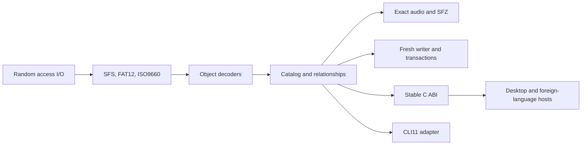

# Architecture

The native implementation separates storage, sampler semantics, and host
integration.

`axk_core` owns format behavior and typed errors. The CLI adapter owns argument
parsing, exit codes, output layout, and report serialization. The C ABI owns
opaque handles, result lifetimes, pagination, cancellation, and callback rules.
Host applications do not need a subprocess or scripting runtime.

The CLI follows a one-way dependency path:

`platform entry -> CLI11 registration -> typed request -> command family -> axklib service`

The source modules reflect that boundary:

- `cli/main.cpp` and `cli/command_line.*` convert platform arguments to checked
  UTF-8 and contain process-level failures.
- `cli/app.*` registers the root command and dispatches typed requests.
- `cli/commands/` owns independent analysis, extraction, report, compatibility,
  and writer/transaction command families.
- `cli/schema/` owns versioned machine-output data structures and their private
  JSON serialization.
- `cli/content_id.*` owns pooled-export identifiers and collision handling.

Command modules orchestrate public library services; they do not contain disk
layout, object decoding, allocation, or audio-conversion rules. Core targets do
not include CLI11 or CLI headers.

Fresh-image and alteration operations use manifests and plans. Applying a plan
writes a temporary destination, validates the result, and then completes the
replacement. Existing source images remain unchanged unless an in-place
transaction is explicitly requested.
