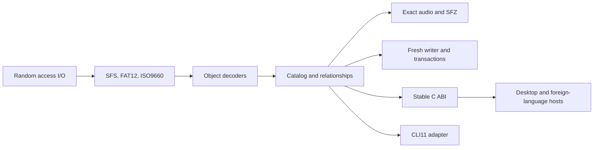

# Architecture

The native implementation separates storage, sampler semantics, and host
integration.

`axk_core` owns format behavior and typed errors. The CLI adapter owns argument
parsing, exit codes, output layout, and report serialization. The C ABI owns
opaque handles, result lifetimes, pagination, cancellation, and callback rules.
Host applications do not need a subprocess or scripting runtime.

Fresh-image and alteration operations use manifests and plans. Applying a plan
writes a temporary destination, validates the result, and then completes the
replacement. Existing source images remain unchanged unless an in-place
transaction is explicitly requested.
