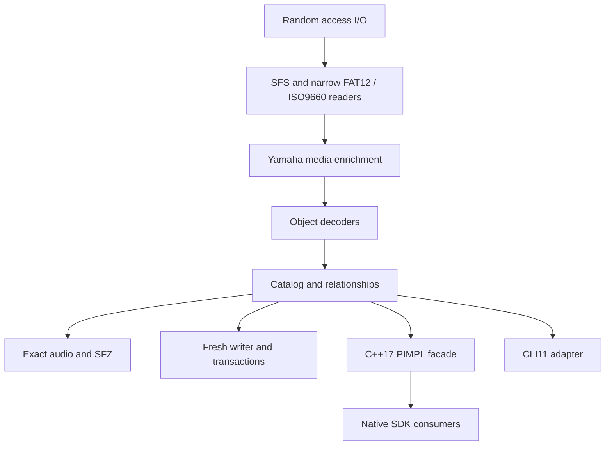

# Architecture

The native implementation separates storage, sampler semantics, and host
integration.

The private C++23 engine owns format behavior and typed errors. The shared SDK
facade owns PIMPL sessions, results, pagination, cancellation, and progress. The
CLI adapter owns argument parsing, exit codes, output layout, and report
serialization. The CLI links the private engine statically; SDK consumers load
the shared library.

The CLI follows a one-way dependency path:

`platform entry -> CLI11 registration -> typed request -> command family -> axklib service`

The source modules reflect that boundary:

- `apps/cli/main.cpp` and `apps/cli/command_line.*` convert platform arguments to checked
  UTF-8 and contain process-level failures.
- `apps/cli/app.*` registers the root command and dispatches typed requests.
- `apps/cli/commands/` owns independent analysis, extraction, report, package,
  and writer/transaction command families.
- `apps/cli/schema/` owns versioned machine-output data structures and their private
  JSON serialization.
- `apps/cli/content_id.*` owns pooled-export identifiers and collision handling.

Command modules orchestrate public library services; they do not contain disk
layout, object decoding, allocation, or audio-conversion rules. Core targets do
not include CLI11 or CLI headers.

The media source modules preserve a separate responsibility boundary:

- `media_fat12.cpp` owns the supported FAT12 container profile.
- `media_iso9660.cpp` owns the supported primary ISO9660 container profile.
- `media_build.cpp` inventories metadata before loading a selected dependency
  closure, enforces public aggregate build limits, and validates written
  payloads through bounded range readers.
- `media_write_fat12.cpp` adapts pinned FatFs to an in-memory 1.44 MB image.
- `media_write_iso9660.cpp` owns the deterministic narrow ISO9660 layout writer
  and writes projected sectors directly to the reserved temporary file without
  retaining a second output-sized image buffer.
- `media_yamaha.cpp` owns Yamaha object recognition, CD menu labels, catalog
  placement, and structured paths.
- `media.cpp` owns common media dispatch and `MediaContainer` orchestration.

These remain source modules in one core target. They are not separately linked
SDK components.

Fresh-image and alteration operations use manifests and plans. Applying a plan
writes a temporary destination, validates the result, and then completes the
replacement. The output path must differ from the source image. Existing source
images therefore remain unchanged.
