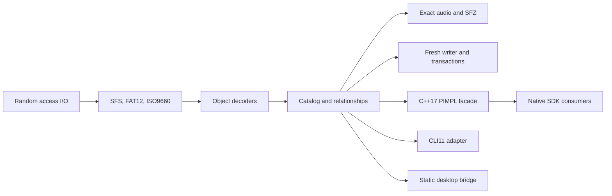

# Architecture

The native implementation separates storage, sampler semantics, and host
integration.

The private C++23 engine owns format behavior and typed errors. The shared SDK
facade owns PIMPL sessions, results, pagination, cancellation, and progress. The
CLI adapter owns argument parsing, exit codes, output layout, and report
serialization. The CLI and desktop bridge link the private engine statically;
SDK consumers load the shared library.

The CLI follows a one-way dependency path:

`platform entry -> CLI11 registration -> typed request -> command family -> axklib service`

The source modules reflect that boundary:

- `apps/cli/main.cpp` and `apps/cli/command_line.*` convert platform arguments to checked
  UTF-8 and contain process-level failures.
- `apps/cli/app.*` registers the root command and dispatches typed requests.
- `apps/cli/commands/` owns independent analysis, extraction, report, compatibility,
  and writer/transaction command families.
- `apps/cli/schema/` owns versioned machine-output data structures and their private
  JSON serialization.
- `apps/cli/content_id.*` owns pooled-export identifiers and collision handling.

Command modules orchestrate public library services; they do not contain disk
layout, object decoding, allocation, or audio-conversion rules. Core targets do
not include CLI11 or CLI headers.

Fresh-image and alteration operations use manifests and plans. Applying a plan
writes a temporary destination, validates the result, and then completes the
replacement. Existing source images remain unchanged unless an in-place
transaction is explicitly requested.
