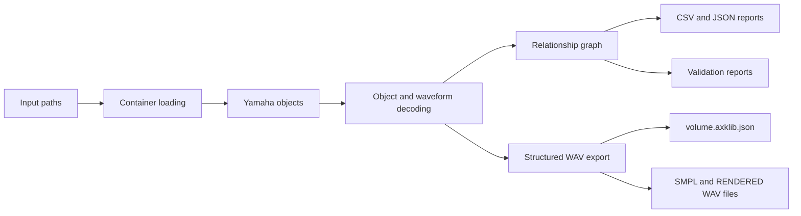

# axklib Architecture

## Overview

`axklib` provides a Python API and command-line interface for reading Yamaha A-series disk images and sampler objects. The package focuses on structured container loading, object decoding, relationship graphs, validation reports, and WAV export.

Applications can use the Python modules directly, while the `axklib` CLI exposes the same services for command-line workflows.

## Package Map

- `axklib.model`: shared object references, container references, quality records, and typed metadata.
- `axklib.containers`: input detection and loading for SFS hard-disk images, FAT floppy images, ISO/CD-ROM images, standalone objects, and directory inputs.
- `axklib.objects`: Yamaha object header and current object metadata decoding.
- `axklib.parameters`: byte-level parameter decoders used by object summaries and reports.
- `axklib.relationships`: relationship graph construction for programs, sample-bank groups, sample banks, and waveform objects.
- `axklib.content_tree`: human-readable hierarchy construction for `info` output.
- `axklib.coverage`: relationship and object coverage summaries.
- `axklib.validation`: validation reports with stable issue codes and policy-aware pass/fail results.
- `axklib.audio`: waveform decoding plus WAV and per-volume object-graph export.
- `axklib.reports`: CSV/JSON serialization and machine-readable schema manifests.

## Data Flow

axklib separates container mechanics from sampler-object semantics:

1. **Input loading** opens paths and identifies the container family.
2. **Container enumeration** discovers partitions, directories, file entries, or embedded object candidates.
3. **Object extraction** records Yamaha object type, name, payload bytes, source identity, offsets, and quality metadata.
4. **Object decoding** adds sampler-facing fields, waveform metadata, program assignments, sample-bank members, and relationship graphs.
5. **Output services** write reports, validation findings, WAV files, and structured export graphs.

This separation lets callers use high-level reports and exports without depending on container-specific layout details.

## Reports And Schemas

CSV and JSON reports are views over the shared model objects. Report directories include schema manifests under `_schemas/` so callers can inspect columns, row counts, quality labels, issue-code counts, and schema notes.

Structured waveform export writes one `volume.axklib.json` graph per volume. The graph links object identity, physical `SMPL` waveform refs, `SBNK` sample/member refs, `SBAC` bank-group refs, `PROG` assignment refs, rendered audio refs, decoded relationships, parameters, quality labels, and unresolved warnings. The sibling `SMPL\` and `RENDERED\` directories contain WAV files referenced by the graph.

## Export Behavior

Waveform decoding is pure: decoded audio is represented in memory before files are written. Exporters use atomic writes, reject accidental overwrites unless replacement is requested, and keep physical `SMPL` WAVs separate from rendered stereo WAVs.

The structured export graph is the public contract for interpreting an export. Callers should read the graph instead of inferring object relationships by crawling output directories.

## Generated Images And Repair

Generated image writing, repair, free-space mutation, and object insertion are not part of the current stable public workflow. Quality labels in reports and graphs help callers distinguish stable decoded values from values that are currently informational.
