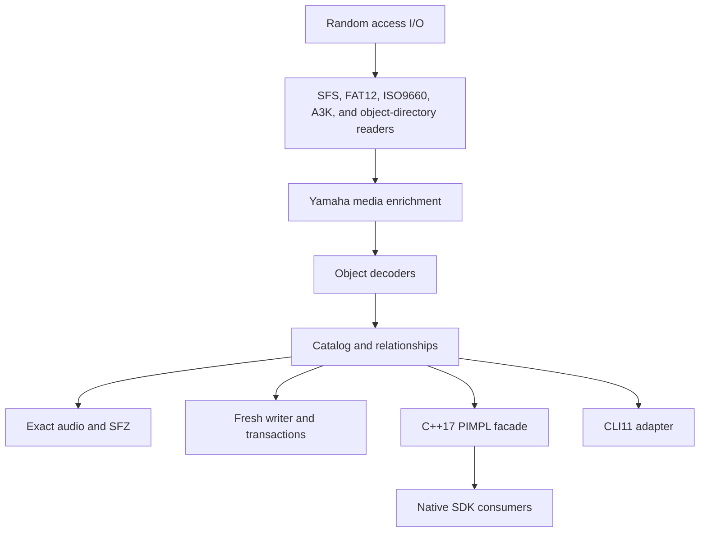

# Architecture

The native implementation separates storage, sampler semantics, and host
integration.

## Desktop Workspace Modules

Axkdeck separates the shared workspace shell from backend orchestration and
device presentation. `src/App.svelte` selects a bundled backend application from
`features/backends/registry.ts`; the existing axklib transport, A-series catalog,
audition, editing and dialog workflows live behind `features/backends/axklib/`.
An alternative backend application does not implement `ImageTransport` or use
A-series object types merely to enter the shell.

`WorkspacePresentation` supplies navigation, central content, optional lower
tools and an optional inspector. It can also supply object tabs, selection
actions and playback controls. All pane geometry, visibility toggles, interface
scaling and the Device/Files switch belong to `WorkspaceShell`. The common image
action area is supplied separately from presentation-specific navigation. The
axklib backend supplies the current A-series Device presentation; adding another
device presentation must not introduce device switches into the shared shell.

The reusable Files components depend only on `FilesystemAccess` and neutral
entry/page contracts in `lib/filesystem.ts`. A backend adapter translates its
wire representation into that contract. It provides stored entry identities,
parents, roots, names, sizes, paging and full-root search; it does not project
sampler relationships into synthetic directories. The sidebar selects roots or
partitions, while the central tree owns directory expansion. Unknown files stay
visible without a device interpretation. Files supports browsing, inspection,
directory creation and confirmed file/recursive directory deletion on writable
SFS roots. Raw file/directory exports are also available for readable roots,
including read-only images. Import review and FAT mutation controls use the
same per-root capability and transaction contracts.

Files selection is scoped to the active root and rendered entries. Modifier
clicks and keyboard ranges support batch deletion; context menus retain an
existing selection. Focus-only navigation does not alter the batch. Changed
searches clear selection, and collapsing a directory replaces selected hidden
descendants with their visible parent. Refresh restores surviving unique paths,
not reused entry IDs. Deletion review includes the complete selection; execution
removes redundant descendant targets and submits one atomic job.

Creation and import destinations use actual selection, not the retained
keyboard cursor: a selected directory, a selected file's parent, or the active
root after deselection. Background clicks clear selection without discarding
expansion or scroll. Dialogs capture their destination before editing starts.
Both cross-mode inspector actions use the fixed `InspectorModeFooter`, labeled
**To Files** and **To Device**, outside the scrolling properties.

The axklib-specific `AxklibFilesView` supplies a SU700 floppy import adapter.
Generic Files components only know its command and drop-interception interface.
The backend advertises `supportedImports: ["SU700_FLOPPY"]` for writable SFS
roots containing a recognized SU700 volume. Empty or unrecognized roots do not
advertise this operation. Other backends can supply their own import adapters.

SU700 import accepts one complete, flat FAT12 image and creates a new named
volume with `SONGCONT.DAT`, `SUSQ` songs and `SUSP` samples. Stored eight-byte
basenames, including internal padding before the extension, and all payload
bytes are preserved. Extra files are included by default and can be deselected.
The shared destination chooser is new-volume-only; merge, overwrite, disk-set
reconstruction and SU700 object editing are not supported. Inspection validates
control references, complete payload boundaries, names and destination capacity.
Execution rechecks source identity and image revision, then uses one atomic
Files transaction with rollback. This is host-validated import support, not a
claim of hardware playback validation.

The separate `FilesystemMutationDriver` binds execution, observation,
cancellation and image refresh. The axklib adapter uses the shared job controller
and invalidates audition before mutation. Review captures the session, entry
identities and revision. A committed write followed by failed refresh can only
retry refresh; interrupted job observation checks the same job rather than
resubmitting its edits. Per-root capabilities disable unsupported controls.

`FilesystemExportActions` supplies the session-bound export job driver and host
destination adapter. Partition menus and the Files toolbar share one review
workflow with a frozen selection/revision, exact output paths and omission
notices. Managed-local batches use one native folder picker; remote sessions
use the existing destination chooser. The selected route survives failures.
Uncertain execution checks the existing job rather than resubmitting. Failed
local download publication retains its archive for an explicit destination
retry; successful publication or closing the review releases that archive.
Export does not mutate the image, refresh selection or repair object links.

Device and Files are independent capabilities. Recognized A-series objects
enable Device; empty SFS images also allow A-series authoring. Files-only images
open in Files with Device unavailable. Archives and standalone object sources
can have Device without a filesystem view. No Akai or E-mu backend is bundled.

The Files controller retains per-root selection, expansion, search and scroll
state while switching modes. Revision changes discard cached entries and
revalidate the active root's identities. Cross-view navigation requires a unique
physical entry/object mapping, opens ancestors, loads the required pages and
reveals the row once. It never guesses by display name. Split floppy sets retain
their separate physical roots without claiming an ambiguous combined-object
mapping. Loading and revision failures remain visible instead of falling back
to a projected object tree.

## Public Documentation Boundary

Public documentation describes supported contracts, limits, validation rules,
and concise hardware compatibility status. Small retained test fixtures may
document their identity, hash, topology, and active test purpose. Runtime
diagnostics describe the input contract and corrective action.

```mermaid
flowchart TD
    accTitle: axklib architecture dependency flow
    accDescr: Random access input flows through media readers, Yamaha enrichment, object decoders, and the catalog. The catalog provides audio export, writing, the shared SDK facade, and the CLI adapter. Native consumers use the SDK.
    IO[Random access I/O] --> Media[SFS, FAT12, ISO9660, A3K, and object-directory readers]
    Media --> Yamaha[Yamaha media enrichment]
    Yamaha --> Objects[Object decoders]
    Objects --> Catalog[Catalog and relationships]
    Catalog --> Audio[Exact audio and SFZ]
    Catalog --> Writer[Fresh writer and transactions]
    Catalog --> SDK[C++17 PIMPL facade]
    Catalog --> CLI[CLI11 adapter]
    SDK --> Host[Native SDK consumers]
```

The private C++23 engine owns format behavior and typed errors. The shared SDK
facade owns PIMPL sessions, results, pagination, cancellation, and progress. The
CLI adapter owns argument parsing, exit codes, output layout, and report
serialization. The CLI links the private engine statically; SDK consumers load
the shared library.

The CLI follows a one-way dependency path:

`platform entry -> CLI11 registration -> typed request -> command family -> axklib service`

The source modules reflect that boundary:

- `apps/cli/main.cpp` and `apps/cli/command_line.*` convert platform arguments to checked
  UTF-8 and contain process-level failures.
- `apps/cli/app.*` registers the root command and dispatches typed requests.
- `apps/cli/commands/` owns independent analysis, extraction, report, package,
  and writer/transaction command families.
- `apps/cli/schema/` owns versioned machine-output data structures and their private
  JSON serialization.
- `apps/application/src/content_id.*` owns pooled-export identifiers and
  collision handling as an application-private extraction helper.

Command modules orchestrate public library services; they do not contain disk
layout, object decoding, allocation, or audio-conversion rules. Core targets do
not include CLI11 or CLI headers.

The media source modules preserve a separate responsibility boundary:

- `media_fat12.cpp` owns shared FAT directory and file reads; `media_ex5.cpp`
  supplies the separate read-only EX5 disk geometry and content projection.
- `media_iso9660.cpp` owns the supported primary ISO9660 container profile.
- `media_a3k_archive.cpp` owns the bounded read-only A3K archive profile.
- `media_build.cpp` inventories metadata before loading a selected dependency
  closure, enforces public aggregate build limits, and validates written
  payloads through bounded range readers.
- `media_write_fat12.cpp` adapts pinned FatFs to an in-memory 1.44 MB image.
- `media_write_iso9660.cpp` owns the deterministic narrow ISO9660 layout writer
  and writes projected sectors directly to the reserved temporary file without
  retaining a second output-sized image buffer.
- `media_yamaha.cpp` owns Yamaha object recognition, CD menu labels, catalog
  placement, flat AXK object directories, and structured paths.
- `media.cpp` owns common media dispatch and `MediaContainer` orchestration.

These remain source modules in one core target. They are not separately linked
SDK components.

Fresh-image and alteration operations use manifests and plans. Applying a plan
writes a temporary destination, validates the result, and then completes the
replacement. The output path must differ from the source image. Existing source
images therefore remain unchanged.

The private write/package implementation is split by invariant ownership:

- `alteration_manifest_json.cpp` owns canonical JSON serialization and typed
  parsing, while
  `alteration_manifest.cpp` validates a complete typed transaction before any
  image I/O. `alteration.cpp` owns stateful planning and mutation.
- `object_write_codec.cpp` and `sfs_write_codec.cpp` own bounded object-payload
  and directory-index encoding. `writer_image.cpp` owns HDS geometry,
  allocation, and publication.
- `package_manifest.cpp` owns canonical package JSON serialization and
  relocation bindings. `package_import_plan.cpp` owns immutable import-plan
  identity and verification; media-specific capacity planning remains in
  `package_import.cpp`.

These are private source boundaries, not installed APIs. Binary fields are
encoded through checked writers, and callers propagate an error instead of
indexing past a malformed or incorrectly sized buffer.
