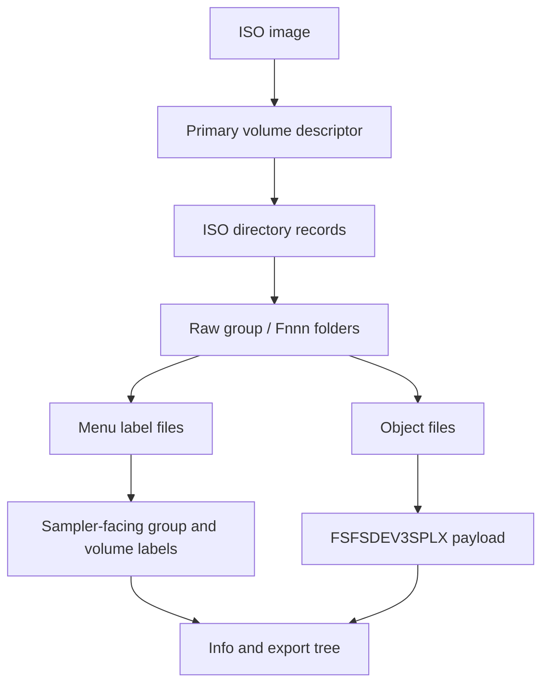

# CD-ROM Images

axklib can inspect Yamaha A-series CD-ROM ISO images. These images use ISO9660
for the outer container and often add a sampler menu layer above the folders that
hold Yamaha object files. The object payloads use the shared format described in
[Sampler Data Structures](sampler-data.md).



## ISO9660 Reader

The low-level ISO reader expects a Primary Volume Descriptor at sector 16. ISO
sectors are 2048 bytes.

This is the primary-directory profile used by maintained Yamaha
A-series CD-ROMs, not a general ISO implementation. Multi-extent files are
rejected. Joliet names, Rock Ridge system-use extensions, alternate descriptor
trees are not interpreted. A hybrid disc can still open through
its valid primary ISO9660 tree; extension-only names and metadata remain outside
the supported contract.

Fresh ISO creation uses a deterministic narrow writer for the same primary-tree
profile. A libarchive writer was evaluated, but its release build provides no
supported way to override the image creation timestamp, so it could not satisfy
the byte-reproducibility contract. The narrow writer emits path tables, bounded
single-sector directories, Yamaha group/volume menu records, and single-extent
object files. It reopens the image with the production reader before publishing
it. Physical Yamaha sampler acceptance remains unverified and is not implied by
that check.

| Field | Rule |
| --- | --- |
| PVD sector | `16` |
| PVD identifier | bytes `1..5` equal `CD001` |
| Volume ID | bytes `40..71`, ASCII, right-trimmed |
| Root directory record | starts at PVD offset `156` |

Directory records use the ISO9660 little-endian extent sector and file size
fields. axklib strips `;version` suffixes and trailing dots from ISO names before
building logical paths.

Directory record fields used by axklib:

| Record offset | Size | Meaning |
| --- | ---: | --- |
| `0x00` | 1 | Directory record length. |
| `0x02` | 4 | Extent sector, little-endian. |
| `0x0a` | 4 | Data size, little-endian. |
| `0x19` | 1 | File flags; bit `0x02` means directory. |
| `0x20` | 1 | File identifier length. |
| `0x21` | variable | File identifier bytes. |

Directory records with name byte `0x00` are `.` and name byte `0x01` are `..`.
Other names are ASCII with replacement for invalid bytes.

## Raw Folder Layout

Many Yamaha CD-ROMs use a raw folder layout shaped like this:

```text
<raw-group>/<raw-volume>/<object-category>/<object-file>
```

The raw group is often an opaque folder identifier. The raw volume is often an
`Fnnn` folder. axklib keeps both raw and sampler-facing identities:

| Identity | Purpose |
| --- | --- |
| Raw ISO path | Stable technical trace in CSV/JSON reports. |
| Sampler-facing label | Normal display name in `info` and structured exports. |

For one object, axklib records:

| Metadata | Meaning |
| --- | --- |
| `iso_raw_group` | First path component in the raw ISO tree. |
| `iso_raw_volume` | Second path component, often `Fnnn`. |
| `iso_group_label` | Decoded sampler-facing group label when available. |
| `iso_volume_label` | Decoded sampler-facing volume label when available. |
| `iso_extent_sector` | ISO extent sector for the file. |
| `iso_data_offset` | Absolute byte offset, `extent_sector * 2048`. |
| `iso_file_size` | File size from the ISO directory record. |
| `iso_recovery_quality` | Loader-quality classification for the object row. |

## Object Discovery

A clean ISO object row comes from an ISO9660 file entry whose bytes start with:

```text
FSFSDEV3SPLX<type>
```

The loader reads the exact file span from the ISO directory entry and accepts the
normal object type tags listed in [Sampler Data Structures](sampler-data.md).

The object key is based on the source image name and logical ISO path. The scope
key is the source image plus ISO scope.

## Loader-Quality Classes

CD-ROM images can contain unusual or partially readable object spans. axklib
keeps a loader-quality field so downstream reports can keep clean ISO traversal
separate from weaker rows.

| Value | Meaning |
| --- | --- |
| `clean-iso9660-object` | Object came from a normal ISO9660 directory entry. |
| `raw-scan-recovered-object` | Object came from a fallback scan path after directory traversal was incomplete. |
| `nonstandard-iso-object` | Object came from a nonstandard reader path. |
| `impossible-internal-capacity` | Object span has internal counts that exceed its recovered capacity. |
| `raw-scan-impossible-internal-capacity` | Same capacity problem on a fallback scan row. |

Normal user-facing trees prefer clean and authoritative rows. Diagnostic reports
keep the loader-quality field for every object.

## Sampler Menu Labels

Yamaha CD-ROM images can store labels used by the sampler's disk menu. axklib
uses these labels for user-facing paths when they are present.

Label sources:

| Label | Typical storage shape | Metadata field |
| --- | --- | --- |
| Group label | Final `_DSKNAME` row in the group `0000` catalog references a 16-byte label file. | `iso_group_label` |
| Volume label | Row in a group-local compact menu table. | `iso_volume_label` |

Each group-catalog row is 32 bytes. Volume rows map a 16-byte display name to
an `Fnnn` volume directory. The final `_DSKNAME` row is NUL-padded and maps to
the next `Fnnn` file after the last volume. A group label is confirmed only when
that row references an existing 16-byte file. Missing or malformed label
metadata does not prevent object inventory; axklib retains the raw group
identifier instead. `axklib validate` reports these sampler-incompatible menu
contracts as errors without turning them into ISO open failures. This keeps
recovery and extraction available while preventing a readable image from being
mistaken for one the sampler will enumerate.

The validated compatibility contract requires each Yamaha group menu to have a
group-level `0000` file made of complete 32-byte rows. Its final row must be
`_DSKNAME`, must reference `F(N+1)` after `N` volume directories, and that target
must be an existing, non-empty, fixed-width 16-byte group-label file. Catalog
hash validation is not part of this compatibility gate because hardware has not
isolated hash rejection independently.

Label precedence for display paths:

1. Decoded CD-ROM menu label stored in the ISO.
2. Content-derived fallback from visible objects in the raw folder.
3. Raw ISO folder identifier.

Content-derived fallback labels are navigation aids. Reports keep raw folder
fields so callers can distinguish fallback labels from decoded menu labels.

## Duplicate Volume Labels

Sampler-facing CD-ROM volume labels are not required to be unique within a group.
When two raw volume folders have the same display label, axklib keeps them as
separate volumes and appends the raw folder suffix:

```text
|-- Or11 Argent (F001) [VOLUME]
|-- Or11 Argent (F002) [VOLUME]
```

This prevents separate ISO folders from being merged while preserving the label
a sampler user recognizes.

## Program Source-Load Assignments

CD-ROM Program assignment rows can describe how objects are loaded from the disc
rather than the active/off state stored in a hard-disk save. axklib keeps this
separate from hard-disk Program assignment state.

Public behavior:

| Case | `info` behavior | Report behavior |
| --- | --- | --- |
| Source-load assignment matched to a target object | Can be shown as a Program child when relationship quality is sufficient. | Row keeps raw ISO path, match method, assignment row, and quality fields. |
| Assignment row with lower quality or no target | Not shown as a normal Program child. | Kept in relationship CSV/JSON diagnostics. |
| Source row whose loaded active/off state is not represented by the ISO row | Stored row remains diagnostic; loaded state is not invented. | `active_assignment_state` can be `source-load-assignment`. |

The raw selector bytes in Program rows are diagnostic fields. They are not used
as public target IDs.

CD-ROM visible/off rows with missing local SBAC targets stay relationship
diagnostics, not Program children. A CD-ROM SBNK member link that selects one
physical waveform in another ISO object folder but whose member name does not
confirm the target stays `Tentative` and is reported as an `sbnk-member-link`
diagnostic.
## Paired Sample-Member Stereo

Some CD-ROM volumes store stereo material as paired sampler-visible `SBNK`
members in one `SBAC` group. The left and right members have matching names with
terminal `-L` and `-R`, and each member links to its own physical `SMPL` object.
Structured waveform export keeps the physical mono `SMPL` files and writes an
additional `_samples/rendered/` stereo WAV when the pair is known and audio-compatible.
For rendered stereo names, duplicate-marked paired members can use the owning
sample-bank or group label so the output path remains sampler-facing instead of
only numeric.

## Path Mapping
CD-ROM path mapping combines raw folder identity and decoded labels:

```text
raw path:        8F6EB510/F001/PROG/F003
facing path:     ORGANS/Or11 Argent/Programs/003: Arg Per4
report fields:   raw group, raw volume, object key, display labels
```

See [Name, Path, And Export Mapping](names-and-paths.md) for duplicate label,
path sanitization, and export directory behavior.

## Validation

CD-ROM validation and diagnostics cover:

| Condition | Handling |
| --- | --- |
| Missing or malformed PVD | Unsupported ISO container. |
| Short read from an ISO extent | Load error for the affected source. |
| Clean ISO object with impossible internal count | Object row marked with an impossible-capacity loader-quality value. |
| Duplicate volume labels | Display name gets raw suffix; reports keep both raw identities. |
| Broken active Program path | Validation reports sampler-facing volume and Program examples. |
| Unmatched source-load assignment | Relationship report row stays diagnostic instead of becoming a Program child. |

## Minimal Read Walkthrough

1. Read sector 16 and validate the ISO Primary Volume Descriptor.
2. Parse the root directory record.
3. Walk directory records recursively, skipping `.` and `..`.
4. Read file bytes by `extent_sector * 2048` and ISO file size.
5. Select files beginning with `FSFSDEV3SPLX` and supported type tags.
6. Decode group and volume labels from Yamaha menu files when present.
7. Attach raw path and sampler-facing label metadata to every object.
8. Decode shared object payloads.
9. Build relationships and source-load Program assignment rows.
10. Render user-facing paths with duplicate-label disambiguation.
