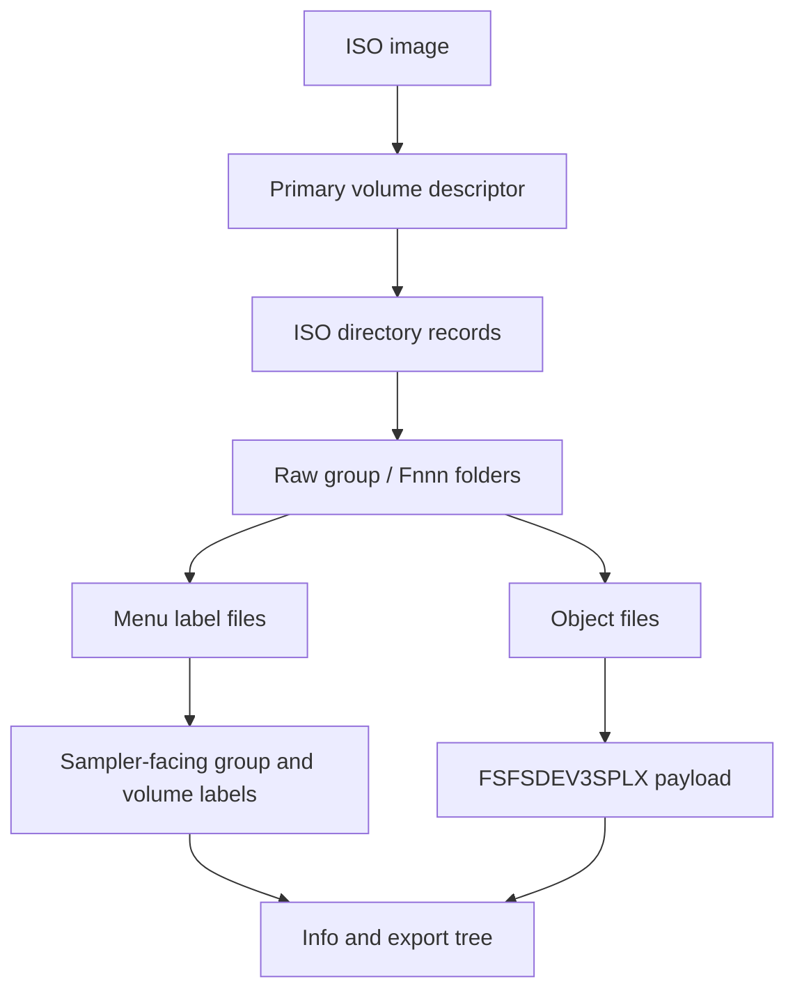

# CD-ROM Images

axklib can inspect Yamaha A-series CD-ROM ISO images. These images use ISO9660
for the outer container and often add a sampler menu layer above the folders that
hold Yamaha object files. The object payloads use the shared format described in
[Sampler Data Structures](sampler-data.md).



## ISO9660 Reader

The low-level ISO reader expects a Primary Volume Descriptor at sector 16. ISO
sectors are 2048 bytes.

This is the primary-directory profile used by maintained Yamaha
A-series CD-ROMs, not a general ISO implementation. Multi-extent files are
rejected. Joliet names, Rock Ridge system-use extensions, alternate descriptor
trees are not interpreted. A hybrid disc can still open through
its valid primary ISO9660 tree; extension-only names and metadata remain outside
the supported contract.

Fresh ISO creation uses a deterministic narrow writer for the same primary-tree
profile. A libarchive writer was evaluated, but its release build provides no
supported way to override the image creation timestamp, so it could not satisfy
the byte-reproducibility contract. The narrow writer emits path tables, bounded
single-sector directories, Yamaha group/volume menu records, and single-extent
object files. It reopens the image with the production reader before publishing
it. Physical Yamaha hardware has enumerated, loaded, and played the minimal
generated profile containing one mono `SMPL` and one direct single-member
`SBNK`. That proof is intentionally narrower than every tree or object topology
the reader can parse.

| Field | Rule |
| --- | --- |
| PVD sector | `16` |
| PVD identifier | bytes `1..5` equal `CD001` |
| Volume ID | bytes `40..71`, ASCII, right-trimmed |
| Root directory record | starts at PVD offset `156` |

Directory records carry both little-endian and big-endian copies of their
numeric fields. axklib requires those copies to agree. It strips `;version`
suffixes and trailing dots from ISO names before building logical paths.

Directory record fields used by this profile:

| Record offset | Size | Meaning |
| --- | ---: | --- |
| `0x00` | 1 | Directory record length. |
| `0x01` | 1 | Extended attribute record length; generated images use zero. |
| `0x02` | 4 | Extent sector, u32le. |
| `0x06` | 4 | Extent sector, u32be; must match `0x02`. |
| `0x0a` | 4 | Data size, u32le. |
| `0x0e` | 4 | Data size, u32be; must match `0x0a`. |
| `0x12` | 7 | Recording time: years since 1900, month, day, hour, minute, second, signed GMT offset. |
| `0x19` | 1 | File flags; bit `0x02` means directory. |
| `0x1a` | 1 | File unit size; generated images use zero. |
| `0x1b` | 1 | Interleave gap size; generated images use zero. |
| `0x1c` | 2 | Volume sequence number, u16le. |
| `0x1e` | 2 | Volume sequence number, u16be; must match `0x1c`. |
| `0x20` | 1 | File identifier length. |
| `0x21` | variable | File identifier bytes. |

Directory records with name byte `0x00` are `.` and name byte `0x01` are `..`.
Other names are ASCII with replacement for invalid bytes.

## Raw Folder Layout

Yamaha CD-ROMs handled by the profile use a raw folder layout shaped like this:

```text
<raw-group>/<raw-volume>/<object-category>/<object-file>
```

The raw group is an opaque identifier, commonly eight uppercase hexadecimal
characters. Its derivation is not part of the supported contract. Raw volume
directories use `Fnnn`; populated object category directories use the embedded
type tags `SMPL`, `SBNK`, `SBAC`, `PROG`, `SEQU`, and `PRF3`.

An ordinary one-volume tree is:

```text
<raw-group>/
  0000                         group volume-label catalog
  F001/                        first raw volume directory
    PROG/
      0000                     Program catalog
      F001 ...                 Program object payloads
    SBAC/
      0000                     Sample Bank Group catalog
      F001 ...                 SBAC object payloads
    SBNK/
      0000                     Sample Bank catalog
      F001 ...                 SBNK object payloads
    SMPL/
      0000                     waveform catalog
      F001 ...                 SMPL object payloads
    SEQU/
      0000                     Sequence catalog
      F001 ...                 SEQU object payloads
    PRF3/
      0000                     profile catalog
      F001 ...                 PRF3 object payloads
  F002                         fixed-width group display label
```

Only populated category directories need to exist. Object numbering restarts
at `F001` inside every category; an `F001` under `SMPL` and an `F001` under
`SBNK` are unrelated files. Each object file is a complete
`FSFSDEV3SPLX<type>` payload. Its embedded tag and name are authoritative; the
`Fnnn` filename is a catalog identity, not an object type or sampler-facing
name.

Input images may encode ISO file identifiers as `0000;1` or `F001;1`. The
reader strips the `;version` suffix and a trailing dot when constructing logical
paths. The generated writer emits identifiers without `;1`.

axklib keeps both raw and sampler-facing identities:

| Identity | Purpose |
| --- | --- |
| Raw ISO path | Stable technical trace in CSV/JSON reports. |
| Sampler-facing label | Normal display name in `info` and structured exports. |

For one object, axklib records:

| Metadata | Meaning |
| --- | --- |
| `iso_raw_group` | First path component in the raw ISO tree. |
| `iso_raw_volume` | Second path component, often `Fnnn`. |
| `iso_group_label` | Decoded sampler-facing group label when available. |
| `iso_volume_label` | Decoded sampler-facing volume label when available. |
| `iso_extent_sector` | ISO extent sector for the file. |
| `iso_data_offset` | Absolute byte offset, `extent_sector * 2048`. |
| `iso_file_size` | File size from the ISO directory record. |
| `iso_recovery_quality` | Loader-quality classification for the object row. |

## Generated ISO File Layout

`axklib create iso` currently emits exactly one group and one volume. The
hardware-verified one-volume profile uses raw volume `F001`, so its group label
is file `F002`. The complete generated ordering is deterministic:

| Sector / region | Generated content |
| --- | --- |
| `0..15` | Zero-filled ISO system area. |
| `16` | One Primary Volume Descriptor. |
| `17` | Volume Descriptor Set Terminator. |
| `18` | Little-endian Type-L path table. |
| `19` | Big-endian Type-M path table. |
| `20...` | Root, group, volume, and populated category directories; one 2048-byte sector each. |
| following sectors | Group catalog, group label, category catalogs, then object payloads in deterministic tree order. |

The writer uses 2048-byte logical blocks, one extent per file, one sector per
directory, and both-endian ISO9660 numeric fields. It sets the PVD System
Identifier to:

```text
APPLE COMPUTER, INC., TYPE: 0002
```

The manifest `iso.volume_id` supplies the PVD Volume Identifier and Volume Set
Identifier. Publisher, preparer, and application fields are `AXKLIB`.
Descriptor timestamps are fixed to the reproducible 1970 value used by this
profile. The writer emits no supplementary descriptor, Joliet tree, Rock Ridge
records, Apple `AA` system-use bytes, multi-extent file, optional duplicate path
tables, or boot catalog.

The generated Primary Volume Descriptor uses these fixed or manifest-derived
fields. Unlisted optional text fields remain space-filled or zero-filled:

| PVD offset | Size | Generated value |
| --- | ---: | --- |
| `0x00` | 1 | Type `1`, Primary Volume Descriptor. |
| `0x01` | 5 | `CD001`. |
| `0x06` | 1 | Descriptor version `1`. |
| `0x08` | 32 | System Identifier shown above, space-padded. |
| `0x28` | 32 | `iso.volume_id`, space-padded. |
| `0x50` | 8 | Total logical block count, both-endian u32. |
| `0x78` | 4 | Volume Set Size `1`, both-endian u16. |
| `0x7c` | 4 | Volume Sequence Number `1`, both-endian u16. |
| `0x80` | 4 | Logical Block Size `2048`, both-endian u16. |
| `0x84` | 8 | Path-table byte count, both-endian u32. |
| `0x8c` | 4 | Type-L path-table sector `18`, u32le. |
| `0x94` | 4 | Type-M path-table sector `19`, u32be. |
| `0x9c` | 34 | Root directory record. |
| `0xbe` | 128 | Volume Set Identifier from `iso.volume_id`, space-padded. |
| `0x13e`, `0x1be`, `0x23e` | 128 each | Publisher, preparer, and application identifiers: `AXKLIB`. |
| `0x32d`, `0x33e`, `0x360` | 17 each | Fixed creation, modification, and effective timestamps. |
| `0x371` | 1 | File structure version `1`. |

The Type-L and Type-M path tables contain the same directory sequence in their
respective byte order. Directory records contain `.` and `..` followed by
children in deterministic insertion order. If all records do not fit in one
sector, creation fails with an unsupported-profile error rather than extending
the directory using an unverified layout.

Each generated path-table record has this shape; a zero pad byte follows an odd
identifier length so the next record starts on an even boundary:

| Record offset | Size | Contents |
| --- | ---: | --- |
| `0x00` | 1 | Directory identifier length. The root identifier is one byte `00`. |
| `0x01` | 1 | Extended attribute record length `0`. |
| `0x02` | 4 | Directory extent sector, little-endian in Type-L and big-endian in Type-M. |
| `0x06` | 2 | One-based parent path-table record number in the table's byte order. Root uses `1`. |
| `0x08` | variable | Directory identifier followed by optional zero padding. |

Every generated directory record uses the fixed recording-time bytes
`46 01 01 00 00 00 00`, representing `1970-01-01 00:00:00` with GMT offset
zero. File unit and interleave sizes are zero, and the volume sequence number
is one.

Populated categories are chosen from each payload's decoded object type. Their
objects are ordered deterministically by type, embedded name, and payload size;
within each category they receive `F001`, `F002`, and so on. A category's
`0000` records use the same order. Fresh authoring currently produces `SMPL`,
`SBNK`, optional `SBAC`, and optional `PROG` objects. Transfer mode can retain
clean existing `SEQU` and `PRF3` payloads as well.

The exact manifest and commands are in
[Create A Hand-Authored CD-ROM ISO](write.md#create-a-hand-authored-cd-rom-iso).

## Object Discovery

A clean ISO object row comes from an ISO9660 file entry whose bytes start with:

```text
FSFSDEV3SPLX<type>
```

The loader reads the exact file span from the ISO directory entry and accepts the
normal object type tags listed in [Sampler Data Structures](sampler-data.md).

The object key is based on the source image name and logical ISO path. The scope
key is the source image plus ISO scope.

## Loader-Quality Classes

CD-ROM images can contain unusual or partially readable object spans. axklib
keeps a loader-quality field so downstream reports can keep clean ISO traversal
separate from weaker rows.

| Value | Meaning |
| --- | --- |
| `clean-iso9660-object` | Object came from a normal ISO9660 directory entry. |
| `raw-scan-recovered-object` | Object came from a fallback scan path after directory traversal was incomplete. |
| `nonstandard-iso-object` | Object came from a nonstandard reader path. |
| `impossible-internal-capacity` | Object span has internal counts that exceed its recovered capacity. |
| `raw-scan-impossible-internal-capacity` | Same capacity problem on a fallback scan row. |

Normal user-facing trees prefer clean and authoritative rows. Diagnostic reports
keep the loader-quality field for every object.

## Sampler Menu Labels

Yamaha CD-ROM images can store labels used by the sampler's disk menu. axklib
uses these labels for user-facing paths when they are present.

Label sources:

| Label | Typical storage shape | Metadata field |
| --- | --- | --- |
| Group label | Final `_DSKNAME` row in the group `0000` catalog references a 16-byte label file. | `iso_group_label` |
| Volume label | Row in a group-local compact menu table. | `iso_volume_label` |

Each catalog row is exactly 32 bytes:

| Row offset | Size | Contents |
| --- | ---: | --- |
| `0x00` | 1 | Hash of the 16-byte display-name field. |
| `0x01` | 16 | Display name. Ordinary rows are ASCII and space-padded. |
| `0x11` | 1 | Hash of the filename bytes. |
| `0x12` | 11 | ASCII filename such as `F001`, followed by zero bytes. |
| `0x1d` | 3 | Zero. |

The hash starts at zero and processes at most 16 bytes, stopping at NUL:

```text
table = [0xaa, 0x55, 0xc3, 0x3c]
hash = 0
for byte in field[0:16]:
    if byte == 0: break
    hash = ((hash XOR table[hash AND 3]) + byte) modulo 256
```

An ordinary group row maps a 16-byte volume display name to an `Fnnn` volume
directory. An ordinary category row maps an object display name to an `Fnnn`
object file. The special final group row differs from ordinary padding: bytes
`0x01..0x08` are `_DSKNAME`, bytes `0x09..0x10` are NUL, and its filename points
to the group-label file.

For `N` consecutively numbered volume directories starting at `F001`, the final
`_DSKNAME` row points to `F(N+1)`. That file is exactly 16 bytes containing the
ASCII group display name padded with spaces. A one-volume writer image therefore
uses this group-level layout:

```text
0000 row 0: <volume display name> -> F001
0000 row 1: _DSKNAME             -> F002
F002:         16-byte group display name
```

A group label is confirmed only when the final row references an existing
16-byte file. Missing or malformed label metadata does not prevent object
inventory; axklib retains the raw group identifier instead. `axklib validate`
reports these sampler-incompatible menu contracts as errors without turning
them into ISO open failures. This keeps recovery and extraction available while
preventing a readable image from being mistaken for one the sampler will
enumerate.

The validated compatibility contract requires each Yamaha group menu to have a
group-level `0000` file made of complete 32-byte rows. Its final row must be
`_DSKNAME`, must reference `F(N+1)` after `N` volume directories, and that target
must be an existing, non-empty, fixed-width 16-byte group-label file. Catalog
hash validation is not part of this compatibility gate because hardware has not
isolated hash rejection independently. The writer nevertheless emits the hash
algorithm above for every group and category row.

Label precedence for display paths:

1. Decoded CD-ROM menu label stored in the ISO.
2. Content-derived fallback from visible objects in the raw folder.
3. Raw ISO folder identifier.

Content-derived fallback labels are navigation aids. Reports keep raw folder
fields so callers can distinguish fallback labels from decoded menu labels.

## Duplicate Volume Labels

Sampler-facing CD-ROM volume labels are not required to be unique within a group.
When two raw volume folders have the same display label, axklib keeps them as
separate volumes and appends the raw folder suffix:

```text
|-- Or11 Argent (F001) [VOLUME]
|-- Or11 Argent (F002) [VOLUME]
```

This prevents separate ISO folders from being merged while preserving the label
a sampler user recognizes.

## Program Source-Load Assignments

CD-ROM Program assignment rows can describe how objects are loaded from the disc
rather than the active/off state stored in a hard-disk save. axklib keeps this
separate from hard-disk Program assignment state.

Public behavior:

| Case | `info` behavior | Report behavior |
| --- | --- | --- |
| Source-load assignment matched to a target object | Can be shown as a Program child when relationship quality is sufficient. | Row keeps raw ISO path, match method, assignment row, and quality fields. |
| Assignment row with lower quality or no target | Not shown as a normal Program child. | Kept in relationship CSV/JSON diagnostics. |
| Source row whose loaded active/off state is not represented by the ISO row | Stored row remains diagnostic; loaded state is not invented. | `active_assignment_state` can be `source-load-assignment`. |

The raw selector bytes in Program rows are diagnostic fields. They are not used
as public target IDs.

CD-ROM visible/off rows with missing local SBAC targets stay relationship
diagnostics, not Program children. A CD-ROM SBNK member link that selects one
physical waveform in another ISO object folder but whose member name does not
confirm the target stays `Tentative` and is reported as an `sbnk-member-link`
diagnostic.

## Paired Sample-Member Stereo

Some CD-ROM volumes store stereo material as paired sampler-visible `SBNK`
members in one `SBAC` group. The left and right members have matching names with
terminal `-L` and `-R`, and each member links to its own physical `SMPL` object.
Structured waveform export keeps the physical mono `SMPL` files and writes an
additional `_samples/rendered/` stereo WAV when the pair is known and audio-compatible.
For rendered stereo names, duplicate-marked paired members can use the owning
sample-bank or group label so the output path remains sampler-facing instead of
only numeric.

## Path Mapping
CD-ROM path mapping combines raw folder identity and decoded labels:

```text
raw path:        8F6EB510/F001/PROG/F003
facing path:     ORGANS/Or11 Argent/Programs/003: Arg Per4
report fields:   raw group, raw volume, object key, display labels
```

See [Name, Path, And Export Mapping](names-and-paths.md) for duplicate label,
path sanitization, and export directory behavior.

## Validation

CD-ROM validation and diagnostics cover:

| Condition | Handling |
| --- | --- |
| Missing or malformed PVD | Unsupported ISO container. |
| Short read from an ISO extent | Load error for the affected source. |
| Missing group-level `0000` | Validation error; readable object inventory remains available. |
| Group `0000` not a multiple of 32 bytes | Validation error for incomplete menu rows. |
| Missing, misplaced, or wrongly targeted `_DSKNAME` row | Validation error with the raw group and expected `Fnnn` target. |
| Missing, empty, or non-16-byte group-label file | Validation error; the raw group remains usable for diagnostics. |
| Clean ISO object with impossible internal count | Object row marked with an impossible-capacity loader-quality value. |
| Duplicate volume labels | Display name gets raw suffix; reports keep both raw identities. |
| Broken active Program path | Validation reports sampler-facing volume and Program examples. |
| Unmatched source-load assignment | Relationship report row stays diagnostic instead of becoming a Program child. |

## Minimal Read Walkthrough

1. Read sector 16 and validate the ISO Primary Volume Descriptor.
2. Parse the root directory record.
3. Walk directory records recursively, skipping `.` and `..`.
4. Read file bytes by `extent_sector * 2048` and ISO file size.
5. Select files beginning with `FSFSDEV3SPLX` and supported type tags.
6. Decode group and volume labels from Yamaha menu files when present.
7. Attach raw path and sampler-facing label metadata to every object.
8. Decode shared object payloads.
9. Build relationships and source-load Program assignment rows.
10. Render user-facing paths with duplicate-label disambiguation.
