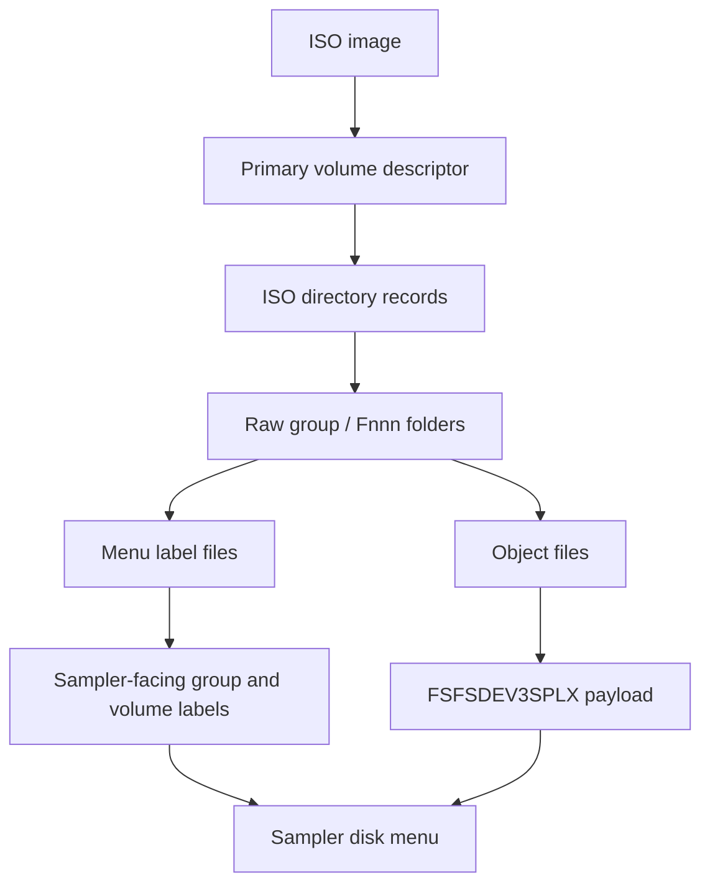

# CD-ROM Images

Yamaha A-series CD-ROM images use ISO9660
for the outer container and often add a sampler menu layer above the folders that
hold Yamaha object files. The object payloads use the shared format described in
[Sampler Data Structures](sampler-data.md).

CD-ROM volumes are source-load content and do not carry the SFS
partition-level `PRF3/SYSTEM` or `PRF3/SYSTEM2` operating context. Programs on
a disc do not define the global Single/Multi receive environment.


```mermaid
flowchart TD
  iso[ISO image] --> pvd[Primary volume descriptor]
  pvd --> dirs[ISO directory records]
  dirs --> raw[Raw group / Fnnn folders]
  raw --> menu[Menu label files]
  raw --> obj[Object files]
  menu --> labels[Sampler-facing group and volume labels]
  obj --> payload[FSFSDEV3SPLX payload]
  labels --> tree[Sampler disk menu]
  payload --> tree
```

## ISO9660 Container

The primary directory profile uses a Primary Volume Descriptor at sector 16. ISO
sectors are 2048 bytes.

This page describes the primary ISO9660 directory tree with single-extent
files. Joliet, Rock Ridge, alternate descriptor trees and multi-extent files
have additional rules outside this specification. Directory records and path
tables can span several sectors; that does not imply multi-extent file storage.

| Field | Rule |
| --- | --- |
| PVD sector | `16` |
| PVD identifier | bytes `1..5` equal `CD001` |
| Volume ID | bytes `40..71`, ASCII, right-trimmed |
| Root directory record | starts at PVD offset `156` |

Directory records carry both little-endian and big-endian copies of their
numeric fields; both copies must agree. `;version` suffixes and trailing dots
are ISO identifier syntax rather than part of the Yamaha object name.

Directory record fields used by this profile:

| Record offset | Size | Meaning |
| --- | ---: | --- |
| `0x00` | 1 | Directory record length. |
| `0x01` | 1 | Extended attribute record length; generated images use zero. |
| `0x02` | 4 | Extent sector, u32le. |
| `0x06` | 4 | Extent sector, u32be; must match `0x02`. |
| `0x0a` | 4 | Data size, u32le. |
| `0x0e` | 4 | Data size, u32be; must match `0x0a`. |
| `0x12` | 7 | Recording time: years since 1900, month, day, hour, minute, second, signed GMT offset. |
| `0x19` | 1 | File flags; bit `0x02` means directory. |
| `0x1a` | 1 | File unit size; generated images use zero. |
| `0x1b` | 1 | Interleave gap size; generated images use zero. |
| `0x1c` | 2 | Volume sequence number, u16le. |
| `0x1e` | 2 | Volume sequence number, u16be; must match `0x1c`. |
| `0x20` | 1 | File identifier length. |
| `0x21` | variable | File identifier bytes. |

Directory records with name byte `0x00` are `.` and name byte `0x01` are `..`.
Other names are ASCII with replacement for invalid bytes.

## Raw Folder Layout

Yamaha CD-ROMs handled by the profile use a raw folder layout shaped like this:

```text
<raw-group>/<raw-volume>/<object-category>/<object-file>
```

The raw group is an opaque identifier, commonly eight uppercase hexadecimal
characters. Its derivation is not part of the supported contract. Raw volume
directories use `Fnnn`; populated object category directories use the embedded
type tags `SMPL`, `SBNK`, `SBAC`, `PROG`, `SEQU`, and `PRF3`.

An ordinary one-volume tree is:

```text
<raw-group>/
  0000                         group volume-label catalog
  F001/                        first raw volume directory
    PROG/
      0000                     Program catalog
      F001 ...                 Program object payloads
    SBAC/
      0000                     Sample Bank catalog
      F001 ...                 SBAC object payloads
    SBNK/
      0000                     Sample catalog
      F001 ...                 SBNK object payloads
    SMPL/
      0000                     waveform catalog
      F001 ...                 SMPL object payloads
    SEQU/
      0000                     Sequence catalog
      F001 ...                 SEQU object payloads
    PRF3/
      0000                     profile catalog
      F001 ...                 PRF3 object payloads
  F002                         fixed-width group display label
```

Only populated category directories need to exist. Object numbering restarts
at `F001` inside every category; an `F001` under `SMPL` and an `F001` under
`SBNK` are unrelated files. Each object file is a complete
`FSFSDEV3SPLX<type>` payload. Its embedded tag and name are authoritative; the
`Fnnn` filename is a catalog identity, not an object type or sampler-facing
name.

Input images may encode ISO file identifiers as `0000;1` or `F001;1`. The
reader strips the `;version` suffix and a trailing dot when constructing logical
paths. The version suffix is distinct from the Yamaha object name.

## Primary Volume Descriptor And Path Tables

The PVD records the volume size, directory root and locations of both path
tables. A valid directory record never crosses a 2048-byte sector boundary;
unused bytes at that boundary are zero. Type-L and Type-M path tables describe
the same directory sequence in little-endian and big-endian order respectively.

| PVD offset | Size | Meaning |
| --- | ---: | --- |
| `0x00`, `0x01`, `0x06` | 1, 5, 1 | Descriptor type 1, `CD001`, version 1 |
| `0x08`, `0x28` | 32 each | System identifier and Volume identifier |
| `0x50` | 8 | Logical block count, both-endian u32 |
| `0x78`, `0x7c`, `0x80` | 4 each | Volume-set size, volume sequence, block size; both-endian u16 |
| `0x84` | 8 | Path-table byte count, both-endian u32 |
| `0x8c`, `0x94` | 4 each | Type-L table sector u32le, Type-M table sector u32be |
| `0x9c` | 34 | Root directory record |
| `0xbe` | 128 | Volume-set identifier |
| `0x13e`, `0x1be`, `0x23e` | 128 each | Publisher, preparer and application identifiers |
| `0x32d`, `0x33e`, `0x360` | 17 each | Creation, modification and effective timestamps |
| `0x371` | 1 | File structure version 1 |

Each path-table entry contains identifier length (u8), extended-attribute length
(u8), extent sector (u32), one-based parent entry number (u16), then identifier
bytes. An odd identifier length has one zero pad byte. Numeric byte order is
that of its table. The root identifier is `00` and its parent number is 1.

Generated image conventions are documented under
[ISO Authoring](write.md#create-a-hand-authored-cd-rom-iso).

## Object Files

Each object file's extent and logical byte count come from the ISO directory
record. A Yamaha object begins with `FSFSDEV3SPLX<type>`. The object header,
not its ISO pathname, determines the payload type. Damaged directory metadata
must not be replaced with guessed ownership from nearby object-like bytes.

## Sampler Menu Labels

Yamaha CD-ROM images store group and volume labels separately from raw folder
identifiers.

Label sources:

| Label | Storage |
| --- | --- |
| Group label | Final `_DSKNAME` row in the group `0000` catalog references a 16-byte label file. |
| Volume label | Row in a group-local menu table. |

Group catalog rows and the supported category-catalog form are 32 bytes:

| Row offset | Size | Contents |
| --- | ---: | --- |
| `0x00` | 1 | Hash of the 16-byte display-name field. |
| `0x01` | 16 | Display name. Ordinary rows are ASCII and space-padded. |
| `0x11` | 1 | Hash of the filename bytes. |
| `0x12` | 11 | ASCII filename such as `F001`, followed by zero bytes. |
| `0x1d` | 3 | Zero. |

The hash starts at zero and processes at most 16 bytes, stopping at NUL:

```text
table = [0xaa, 0x55, 0xc3, 0x3c]
hash = 0
for byte in field[0:16]:
    if byte == 0: break
    hash = ((hash XOR table[hash AND 3]) + byte) modulo 256
```

Some Yamaha CD-ROM category catalogs use a shifted-first-row variant. The first
logical 32-byte row has its initial four bytes (the name hash and first three
display-name bytes) elided, so the retained 28 bytes start with the remaining
13 display-name bytes and place the filename at file offset `0x0e`. Subsequent
rows are ordinary 32-byte rows starting at file offset `0x1c`, and four zero
bytes pad the tail. The reader selects the layout that yields coherent `Fnnn`
targets; ordinary category rows contain 32 bytes.

An ordinary group row maps a 16-byte volume display name to an `Fnnn` volume
directory. An ordinary category row maps an object display name to an `Fnnn`
object file. The special final group row differs from ordinary padding: bytes
`0x01..0x08` are `_DSKNAME`, bytes `0x09..0x10` are NUL, and its filename points
to the group-label file.

A populated category's catalog maps distinct `Fnnn` targets to existing object
files, and every object file has a catalog row. Empty categories do not require
a catalog. Catalog labels can be truncated or space-normalized relative to
embedded names; label equality is not an object-identity rule. Menu consistency
and readability of individual ISO extents are separate properties.

For `N` consecutively numbered volume directories starting at `F001`, the final
`_DSKNAME` row points to `F(N+1)`. That file is exactly 16 bytes containing the
ASCII group display name padded with spaces. A one-volume layout therefore
uses this group-level layout:

```text
0000 row 0: <volume display name> -> F001
0000 row 1: _DSKNAME             -> F002
F002:         16-byte group display name
```

A group label requires an existing 16-byte target. Missing or malformed labels
do not change the raw ISO directory identity, but can prevent correct sampler
menu enumeration. Two distinct raw volume directories may have identical display
labels; that does not merge their files or lookup scopes.

## Program Source-Load Assignments

A source-load row can describe a target type different from the object stored
on the disc. This must not be confused with an ordinary saved Program
assignment. The selector is not a public object identifier.

A Sample's Wave Data name is resolved within its own raw volume. A matching
name in another volume does not remove a local ambiguity or supply a missing
local member. Cached member references can be stale and do not override the
stored name. See [Program assignments](sampler-data.md#program-assignment-rows).

## Paired Sample-Member Stereo

Some CD-ROM volumes store stereo material as paired sampler-visible `SBNK`
Samples in one `SBAC` Sample Bank. The left and right Samples have matching names with
terminal `-L` and `-R`, and each member links to its own physical `SMPL` object.
Each Sample remains a separate object; a paired filename alone is insufficient
to establish matching sample rate, width and playback length.

For display paths, diagnostics and stereo export, see
[Names, Paths, And Exports](names-and-paths.md) and [Report Schemas](report-schemas.md).

## Minimal Read Walkthrough

1. Read sector 16 and validate the ISO Primary Volume Descriptor.
2. Parse the root directory record.
3. Walk directory records recursively, skipping `.` and `..`.
4. Read file bytes by `extent_sector * 2048` and ISO file size.
5. Select files beginning with `FSFSDEV3SPLX` and supported type tags.
6. Decode group and volume labels from Yamaha menu files when present.
7. Keep raw paths distinct from sampler-facing labels.
8. Decode shared object payloads.
9. Build relationships and source-load Program assignment rows.
10. Keep duplicate display labels in their separate raw directory scopes.
