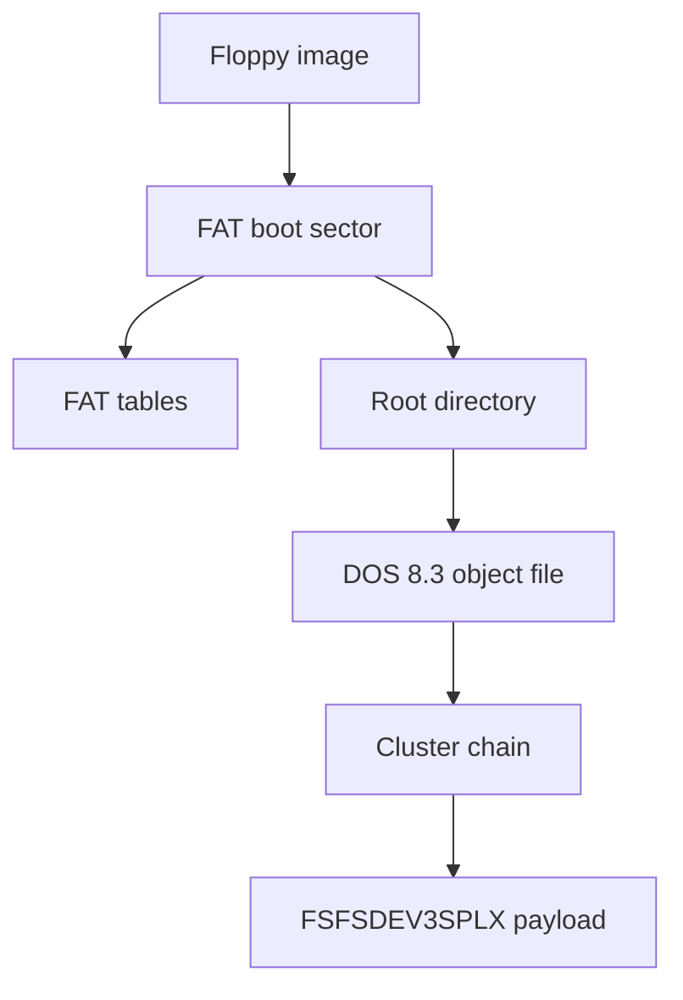

# FAT12 Floppy Images

Yamaha A-series floppy images handled by axklib use a FAT12 container and store
Yamaha sampler object files in the FAT root directory. The FAT12 layer supplies
file enumeration and cluster-chain reads. The embedded object payloads use the
shared sampler object format described in [Sampler Data Structures](sampler-data.md).



## Container Detection

axklib treats `.ima` and `.img` files as FAT12 floppy candidates when they are
not SFS images and do not match another supported container. The FAT reader then
parses the boot sector. An image is rejected if the boot sector is too short or
contains invalid geometry such as zero bytes per sector, zero sectors per
cluster, or zero sectors per FAT.

A floppy image can contain `FSFSDEV3SPLX` object files without being an SFS
hard-disk image. Keep those layers separate.

## Compatibility Profile

The reader supports the FAT12 profile used by maintained Yamaha
A-series floppy media; it is not a general FAT implementation. It follows
bounded FAT12 cluster chains, requires duplicated FAT copies to agree, and uses
DOS 8.3 directory identities. Long-filename entries are ignored in favor of
their 8.3 aliases. FAT16, FAT32, exFAT, filesystem repair, and filesystem
alteration are unsupported.

Fresh image creation uses pinned FatFs code behind axklib's target-neutral
object build plan. It is limited to a deterministic 1.44 MB superfloppy and
root-directory object files. The generated image is reopened by this reader
before publication. This profile has not yet been promoted by a physical Yamaha
sampler test, so parser-valid output is not a hardware-compatibility claim.

## FAT12 Geometry

Maintained 1.44 MB Yamaha floppies use the values in the `Yamaha profile`
column. axklib normalizes the pinned FatFs formatter output to that same media
descriptor and CHS profile before mounting and populating the image. The reader
still validates actual filesystem geometry rather than requiring one boot-sector
identity.

| Field | Boot offset | Size/type | Yamaha profile | Generated value |
| --- | ---: | --- | ---: | ---: |
| Bytes per sector | `0x0b` | u16le | `512` | `512` |
| Sectors per cluster | `0x0d` | u8 | `1` | `1` |
| Reserved sectors | `0x0e` | u16le | `1` | `1` |
| FAT count | `0x10` | u8 | `2` | `2` |
| Root directory entries | `0x11` | u16le | `224` | `224` |
| Total sectors, 16-bit | `0x13` | u16le | `2880` | `2880` |
| Media descriptor | `0x15` | u8 | `0xf0` | `0xf0` |
| Sectors per FAT | `0x16` | u16le | `9` | `9` |
| Sectors per track | `0x18` | u16le | `18` | `18` |
| Heads | `0x1a` | u16le | `2` | `2` |
| Hidden sectors | `0x1c` | u32le | `0` | `0` |
| Total sectors, 32-bit fallback | `0x20` | u32le | `0` when `0x13` is used | `0` |

Derived offsets:

```text
root_dir_sectors = ceil(root_entries * 32 / bytes_per_sector)
fat_offset       = reserved_sectors * bytes_per_sector
root_offset      = (reserved_sectors + fat_count * sectors_per_fat) * bytes_per_sector
data_offset      = root_offset + root_dir_sectors * bytes_per_sector
cluster_size     = bytes_per_sector * sectors_per_cluster
```

For the common 1.44 MB layout, `data_offset` is `0x4200`.

The generated boot sector also has these deterministic fields:

| Offset | Size | Generated bytes/value |
| --- | ---: | --- |
| `0x00` | 3 | Boot jump `eb 58 90`. |
| `0x03` | 8 | OEM name `WINIMAGE`. |
| `0x24` | 1 | BIOS drive number `0x00`. |
| `0x26` | 1 | Extended boot signature `0x29`. |
| `0x27` | 4 | Volume serial `0x5c210b40`, u32le. |
| `0x2b` | 11 | Eleven spaces. No root-directory volume-label entry is generated. |
| `0x36` | 8 | Filesystem text `FAT12` padded with spaces; FAT type still comes from cluster count. |
| `0x1fe` | 2 | Signature `55 aa`. |

Generated object directory entries use the archive attribute `0x20`. Creation
and modification timestamps are fixed to `2026-01-01 00:00:00`; last-access
dates are zero. This fixed metadata is a reproducibility convention, not a
sampler-facing object field.

The media descriptor is also written to byte zero of both FAT copies. This
keeps the BPB and FAT reserved entry consistent; changing only boot offset
`0x15` would produce a superficially plausible but internally inconsistent
image.

## FAT12 Entries

FAT12 stores 12-bit cluster-chain entries packed across bytes. axklib reads an
entry for cluster `n` with:

```text
byte_index = fat_offset + n + n // 2
pair       = image[byte_index] | (image[byte_index + 1] << 8)
value      = pair >> 4          if n is odd
value      = pair & 0x0fff      if n is even
```

Cluster-chain traversal starts at the root directory entry's first cluster and
continues while:

```text
2 <= cluster < 0xff8
```

Values `0xff8..0xfff` are treated as end-of-chain values. The reader tracks seen
clusters and reports a loop if the chain repeats a cluster.

## Root Directory Entries

The root directory contains fixed 32-byte entries. axklib scans up to the boot
sector's `root_entries` count.

| Entry offset | Size | Meaning |
| --- | ---: | --- |
| `0x00` | 8 | DOS 8.3 stem, space-padded. |
| `0x08` | 3 | DOS 8.3 extension, space-padded. |
| `0x0b` | 1 | Attribute byte. |
| `0x1a` | 2 | First cluster, u16le. |
| `0x1c` | 4 | File size in bytes, u32le. |

Entry handling:

| First byte / attribute | Reader behavior |
| --- | --- |
| `0x00` first byte | End of used root directory entries. |
| `0xe5` first byte | Deleted entry; skipped. |
| Attribute `0x0f` | Long-file-name entry; skipped. |
| Attribute with `0x08` set | Volume-label entry; skipped. |
| Attribute with `0x10` set | Subdirectory; its FAT chain is checked and queued for bounded traversal. |
| File size `0` | Skipped by the current object reader. |

The reader starts with the fixed root directory and then traverses ordinary
subdirectories. `.` and `..` entries are ignored. Cluster ownership is global:
a file or directory that reuses a cluster already claimed by another entry is
rejected as cross-linked. The current writer deliberately emits object files in
the root directory only.

## DOS 8.3 Name Parsing

The filename is decoded as ASCII:

```text
stem = entry[0:8].decode("ascii", replace).rstrip()
ext  = entry[8:11].decode("ascii", replace).rstrip()
name = stem + "." + ext if ext else stem
```

Examples:

```text
SINE____.003
SMP_2555.004
```

The FAT filename is placement metadata. The sampler-facing object name comes
from the embedded object header, not from the FAT filename. A numeric extension
such as `.003` is not an object-type code. The authoritative type is the four
bytes after `FSFSDEV3SPLX` inside the file.

## Yamaha Files In Existing Floppies

Supported Yamaha floppy images commonly contain these root-file classes:

| File class | Typical name | Contents and handling |
| --- | --- | --- |
| Sampler object | `SINE____.003`, `SMP_2555.004` | Complete `FSFSDEV3SPLX<type>` payload. The embedded type and name are authoritative. |
| Symbol/support metadata | `YAMAHA.SYM` | Non-object Yamaha support data. It is preserved by the source image but ignored by normal object inventory. |
| Model/system metadata | names such as `A3000_SY.002` | Non-object support data observed on some media. Its payload is not part of the public object decoder. |
| Other DOS file | any valid DOS 8.3 name | Readable through the FAT layer, but ignored by object inventory unless it begins with a supported object signature. |

Object stems often resemble an uppercase, DOS-compatible projection of the
embedded object name. Numeric extensions commonly reflect file placement or
save order. Neither convention is required for decoding, and neither replaces
the embedded header identity. There is no CD-style `0000` category catalog or
`_DSKNAME` group row on this floppy profile.

Known object tags and their inner byte layouts are documented in
[Sampler Data Structures](sampler-data.md). In particular, `SMPL` waveform
payload boundaries come from the embedded big-endian header fields rather than
from filename or FAT allocation length.

## Generated Floppy File Layout

`axklib create floppy` writes exactly one root-directory file for each prepared
Yamaha object. It does not create `YAMAHA.SYM`, model-specific system metadata,
subdirectories, a root-directory FAT volume-label entry, or long filenames.

Objects are sorted deterministically by object type, embedded name, and payload
size. Known types sort as `SMPL`, `SBNK`, `SBAC`, `PROG`, `SEQU`, then `PRF3`.
Each DOS filename is generated as follows:

```text
stem:
  scan the embedded object name from left to right
  keep ASCII letters, digits, and underscore
  uppercase retained characters
  stop after 8 characters
  use OBJECT if no character remains

extension:
  one-based position in the complete sorted object list
  formatted as three decimal digits: 001, 002, ... 224
```

If two stems collide, the later stem is shortened and its one-based global
position is appended. If that still collides, image creation fails rather than
silently replacing a file. The writer supports at most 224 objects because the
fixed root directory has 224 entries.

For example, freshly authored Wave Data and a Sample both named
`Authored Tone` are sorted as `SMPL` then `SBNK` and become:

```text
AUTHORED.001   FSFSDEV3SPLXSMPL...
AUTHORE2.002   FSFSDEV3SPLXSBNK...
```

The filename algorithm is a generated-container convention. Transferring an
existing object preserves every object payload byte but generates new DOS
filenames; it does not preserve the source directory entry or cluster chain.

## Reading File Bytes

A FAT file read is:

```text
remaining = file_size
for cluster in cluster_chain:
    offset = data_offset + (cluster - 2) * cluster_size
    append image[offset : offset + min(cluster_size, remaining)]
    remaining -= cluster_size
return first file_size bytes
```

The first byte of a Yamaha object payload is normally the first byte of the FAT
file. axklib records both the FAT file's first cluster and the absolute object
byte offset:

```text
object_offset = data_offset + (first_cluster - 2) * cluster_size
```

If the shared object header reports an internal payload start, axklib also
records `stored_payload_offset = object_offset + header_size`.

## Embedded Object Detection

A FAT file is handed to the sampler object decoder when its bytes start with:

```text
FSFSDEV3SPLX<type>
```

Supported type tags are listed in [Sampler Data Structures](sampler-data.md).
The FAT reader attaches this placement metadata to each object:

| Metadata | Meaning |
| --- | --- |
| `fat_file` | Slash-separated DOS 8.3 logical path. Root files contain only the filename. |
| `fat_directory_offset` | Absolute byte offset of the file's directory entry, whether in the fixed root or a subdirectory cluster. |
| `fat_first_cluster` | First cluster from the root directory entry. |
| `fat_cluster_count` | Number of clusters followed by the chain. |
| `fat_file_size` | File size from the root directory entry. |
| `fat_object_offset` | Absolute byte offset of the object file start. |
| `fat_stored_payload_offset` | Object offset plus shared header size when known. |

The object key is based on the FAT logical path. The scope key is the FAT root;
subdirectory components remain part of the object key and `fat_file` metadata.

## Validation And Diagnostics

FAT12 diagnostics are split into container and sampler-data problems.

| Condition | Report shape |
| --- | --- |
| Boot sector too short | Unsupported FAT/floppy container. |
| Invalid geometry | Unsupported FAT/floppy container. |
| Repeated cluster in a chain | FAT chain loop error for the affected file. |
| File does not start with object magic | Ignored by object scan. |
| Unsupported object type tag | Ignored by normal object loader or surfaced as unsupported in lower-level reports. |
| Sampler object decode issue | Reported by object, relationship, validation, or export commands. |

## Minimal Read Walkthrough

1. Read the first 512 bytes and parse the FAT geometry fields.
2. Compute FAT, root-directory, and data-area offsets.
3. Iterate fixed 32-byte root directory entries.
4. Skip deleted, empty, label, and long-name entries; traverse bounded
   subdirectories.
5. Decode the DOS 8.3 filename, first cluster, and file size.
6. Follow the FAT12 cluster chain and reassemble the file bytes.
7. Select files beginning with `FSFSDEV3SPLX`.
8. Decode the shared object header and attach FAT placement metadata.
9. Pass the object payload to the shared sampler-data decoder.
