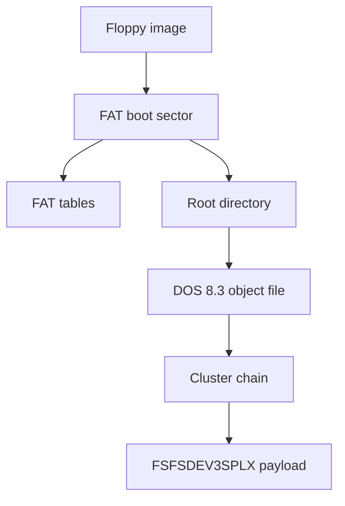

# FAT12 Floppy Images

Yamaha A-series floppy images handled by axklib use a FAT12 container and store
Yamaha sampler object files in the FAT root directory. The FAT12 layer supplies
file enumeration and cluster-chain reads. The embedded object payloads use the
shared sampler object format described in [Sampler Data Structures](sampler-data.md).



## Container Detection

axklib treats `.ima` and `.img` files as FAT12 floppy candidates when they are
not SFS images and do not match another supported container. The FAT reader then
parses the boot sector. An image is rejected if the boot sector is too short or
contains invalid geometry such as zero bytes per sector, zero sectors per
cluster, or zero sectors per FAT.

A floppy image can contain `FSFSDEV3SPLX` object files without being an SFS
hard-disk image. Keep those layers separate.

## Compatibility Profile

The reader supports the FAT12 profile used by maintained Yamaha
A-series floppy media; it is not a general FAT implementation. It follows
bounded FAT12 cluster chains, requires duplicated FAT copies to agree, and uses
DOS 8.3 directory identities. Long-filename entries are ignored in favor of
their 8.3 aliases. FAT16, FAT32, exFAT, filesystem repair, and filesystem
alteration are unsupported.

Fresh image creation uses pinned FatFs code behind axklib's target-neutral
object build plan. It is limited to a deterministic 1.44 MB superfloppy and
root-directory object files. The generated image is reopened by this reader
before publication. This profile has not yet been promoted by a physical Yamaha
sampler test, so parser-valid output is not a hardware-compatibility claim.

## FAT12 Geometry

The current Yamaha floppy images supported by axklib use this geometry:

| Field | Boot-sector offset | Size | Type | Common value |
| --- | ---: | ---: | --- | ---: |
| Bytes per sector | `0x0b` | 2 | u16le | `512` |
| Sectors per cluster | `0x0d` | 1 | u8 | `1` |
| Reserved sectors | `0x0e` | 2 | u16le | `1` |
| FAT count | `0x10` | 1 | u8 | `2` |
| Root directory entries | `0x11` | 2 | u16le | `224` |
| Total sectors, 16-bit | `0x13` | 2 | u16le | `2880` |
| Media descriptor | `0x15` | 1 | u8 | `0xf0` |
| Sectors per FAT | `0x16` | 2 | u16le | `9` |
| Sectors per track | `0x18` | 2 | u16le | `18` |
| Heads | `0x1a` | 2 | u16le | `2` |
| Total sectors, 32-bit fallback | `0x20` | 4 | u32le | used when `0x13` is zero |

Derived offsets:

```text
root_dir_sectors = ceil(root_entries * 32 / bytes_per_sector)
fat_offset       = reserved_sectors * bytes_per_sector
root_offset      = (reserved_sectors + fat_count * sectors_per_fat) * bytes_per_sector
data_offset      = root_offset + root_dir_sectors * bytes_per_sector
cluster_size     = bytes_per_sector * sectors_per_cluster
```

For the common 1.44 MB layout, `data_offset` is `0x4200`.

## FAT12 Entries

FAT12 stores 12-bit cluster-chain entries packed across bytes. axklib reads an
entry for cluster `n` with:

```text
byte_index = fat_offset + n + n // 2
pair       = image[byte_index] | (image[byte_index + 1] << 8)
value      = pair >> 4          if n is odd
value      = pair & 0x0fff      if n is even
```

Cluster-chain traversal starts at the root directory entry's first cluster and
continues while:

```text
2 <= cluster < 0xff8
```

Values `0xff8..0xfff` are treated as end-of-chain values. The reader tracks seen
clusters and reports a loop if the chain repeats a cluster.

## Root Directory Entries

The root directory contains fixed 32-byte entries. axklib scans up to the boot
sector's `root_entries` count.

| Entry offset | Size | Meaning |
| --- | ---: | --- |
| `0x00` | 8 | DOS 8.3 stem, space-padded. |
| `0x08` | 3 | DOS 8.3 extension, space-padded. |
| `0x0b` | 1 | Attribute byte. |
| `0x1a` | 2 | First cluster, u16le. |
| `0x1c` | 4 | File size in bytes, u32le. |

Entry handling:

| First byte / attribute | Reader behavior |
| --- | --- |
| `0x00` first byte | End of used root directory entries. |
| `0xe5` first byte | Deleted entry; skipped. |
| Attribute `0x0f` | Long-file-name entry; skipped. |
| Attribute with `0x08` or `0x10` set | Volume label or directory; skipped by the current object reader. |
| File size `0` | Skipped by the current object reader. |

The current reader uses root-directory files only. If subdirectories are present,
they are ignored by the object scan unless future reader behavior changes.

## DOS 8.3 Name Parsing

The filename is decoded as ASCII:

```text
stem = entry[0:8].decode("ascii", replace).rstrip()
ext  = entry[8:11].decode("ascii", replace).rstrip()
name = stem + "." + ext if ext else stem
```

Examples:

```text
SINE____.003
SMP_2555.004
```

The FAT filename is placement metadata. The sampler-facing object name comes
from the embedded object header, not from the FAT filename.

## Reading File Bytes

A FAT file read is:

```text
remaining = file_size
for cluster in cluster_chain:
    offset = data_offset + (cluster - 2) * cluster_size
    append image[offset : offset + min(cluster_size, remaining)]
    remaining -= cluster_size
return first file_size bytes
```

The first byte of a Yamaha object payload is normally the first byte of the FAT
file. axklib records both the FAT file's first cluster and the absolute object
byte offset:

```text
object_offset = data_offset + (first_cluster - 2) * cluster_size
```

If the shared object header reports an internal payload start, axklib also
records `stored_payload_offset = object_offset + header_size`.

## Embedded Object Detection

A FAT file is handed to the sampler object decoder when its bytes start with:

```text
FSFSDEV3SPLX<type>
```

Supported type tags are listed in [Sampler Data Structures](sampler-data.md).
The FAT reader attaches this placement metadata to each object:

| Metadata | Meaning |
| --- | --- |
| `fat_file` | DOS 8.3 root filename. |
| `fat_directory_offset` | Absolute byte offset of the root directory entry. |
| `fat_first_cluster` | First cluster from the root directory entry. |
| `fat_cluster_count` | Number of clusters followed by the chain. |
| `fat_file_size` | File size from the root directory entry. |
| `fat_object_offset` | Absolute byte offset of the object file start. |
| `fat_stored_payload_offset` | Object offset plus shared header size when known. |

The object key is based on the source image name and FAT filename. The scope key
is the source image plus a FAT root scope.

## Validation And Diagnostics

FAT12 diagnostics are split into container and sampler-data problems.

| Condition | Report shape |
| --- | --- |
| Boot sector too short | Unsupported FAT/floppy container. |
| Invalid geometry | Unsupported FAT/floppy container. |
| Repeated cluster in a chain | FAT chain loop error for the affected file. |
| File does not start with object magic | Ignored by object scan. |
| Unsupported object type tag | Ignored by normal object loader or surfaced as unsupported in lower-level reports. |
| Sampler object decode issue | Reported by object, relationship, validation, or export commands. |

## Minimal Read Walkthrough

1. Read the first 512 bytes and parse the FAT geometry fields.
2. Compute FAT, root-directory, and data-area offsets.
3. Iterate fixed 32-byte root directory entries.
4. Skip deleted, empty, label, and long-name entries; traverse bounded
   subdirectories.
5. Decode the DOS 8.3 filename, first cluster, and file size.
6. Follow the FAT12 cluster chain and reassemble the file bytes.
7. Select files beginning with `FSFSDEV3SPLX`.
8. Decode the shared object header and attach FAT placement metadata.
9. Pass the object payload to the shared sampler-data decoder.
