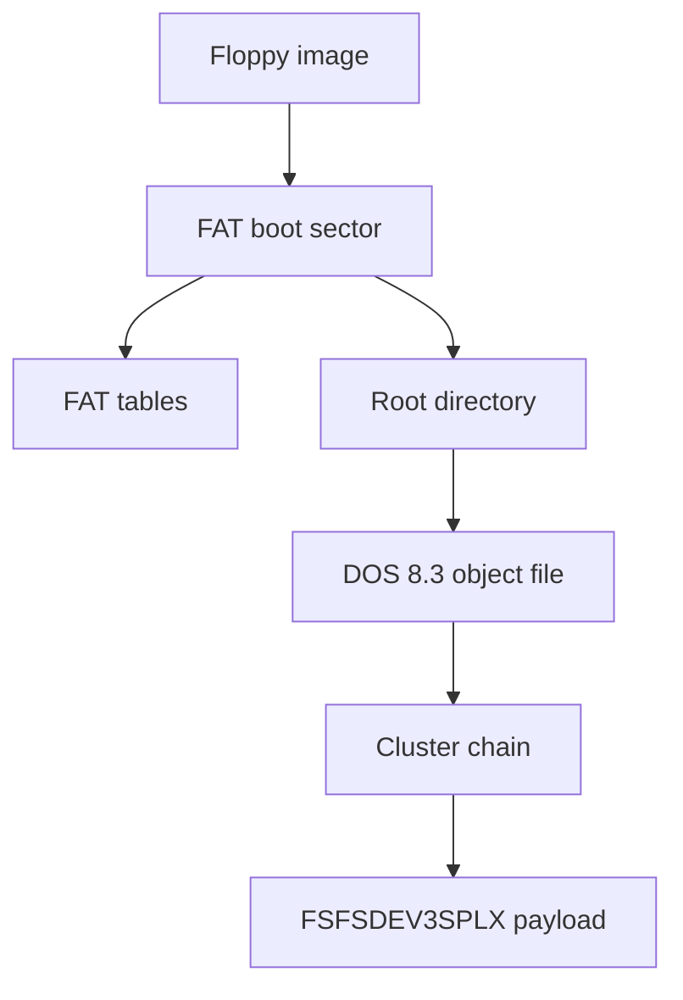

# FAT12 Floppy Images

Yamaha A-series floppy images use a FAT12 container and store
Yamaha sampler object files in the FAT root directory. The FAT12 layer supplies
file enumeration and cluster-chain reads. The embedded object payloads use the
shared sampler object format described in [Sampler Data Structures](sampler-data.md).


```mermaid
flowchart TD
  image[Floppy image] --> boot[FAT boot sector]
  boot --> fat[FAT tables]
  boot --> root[Root directory]
  root --> entry[DOS 8.3 object file]
  entry --> chain[Cluster chain]
  chain --> payload[FSFSDEV3SPLX payload]
```

## Container Detection

Image extensions do not determine the filesystem. A FAT12 boot sector must
supply nonzero sector, cluster and FAT sizes with all regions inside the image.
FAT12 is distinct from the SFS container even when files share Yamaha object
headers. FAT16, FAT32 and exFAT are different layouts.

An extracted object directory is not a floppy image: FAT allocation, labels,
directory order, deleted entries and support files cannot be reconstructed
from object payloads alone. Multi-disk Wave Data uses the segment fields in
[SMPL](sampler-data.md#smpl-wave-data-object).

For software support, creation and import workflows see
[Media Profiles](media.md) and [Writer And Alteration](write.md).

## FAT12 Geometry

The following geometry describes the 1.44 MB Yamaha profile. Other FAT
geometries must be interpreted from their own boot fields.

| Field | Boot offset | Size/type | Yamaha profile |
| --- | ---: | --- | ---: |
| Bytes per sector | `0x0b` | u16le | `512` |
| Sectors per cluster | `0x0d` | u8 | `1` |
| Reserved sectors | `0x0e` | u16le | `1` |
| FAT count | `0x10` | u8 | `2` |
| Root directory entries | `0x11` | u16le | `224` |
| Total sectors, 16-bit | `0x13` | u16le | `2880` |
| Media descriptor | `0x15` | u8 | `0xf0` |
| Sectors per FAT | `0x16` | u16le | `9` |
| Sectors per track | `0x18` | u16le | `18` |
| Heads | `0x1a` | u16le | `2` |
| Hidden sectors | `0x1c` | u32le | `0` |
| Total sectors, 32-bit fallback | `0x20` | u32le | `0` when `0x13` is used |

Derived offsets:

```text
root_dir_sectors = ceil(root_entries * 32 / bytes_per_sector)
fat_offset       = reserved_sectors * bytes_per_sector
root_offset      = (reserved_sectors + fat_count * sectors_per_fat) * bytes_per_sector
data_offset      = root_offset + root_dir_sectors * bytes_per_sector
cluster_size     = bytes_per_sector * sectors_per_cluster
```

For the common 1.44 MB layout, `data_offset` is `0x4200`.

The Yamaha blank-media profile has these boot fields:

| Offset | Size | Quick format | Full format |
| --- | ---: | --- | --- |
| `0x00` | 3 | `eb 44 90` | `eb 44 90` |
| `0x03` | 8 | `YAMAHA  ` | `YAMAHA  ` |
| `0x2b` | 11 | Eleven spaces | Zero |
| `0x1fe` | 2 | Zero; no signature | Zero; no signature |

Both blank formats contain `YAMAHA.SYM` at cluster 2 with size 9,766 and a
zero-length `A3000_SY.002`. Their blank root label entry has attribute `0x28`
for quick format and `0x08` for full format. Full format additionally stores
write time `0x2000` and initializes unused bytes after catalog offset `0x6826`
to `0xe5`; quick format leaves them zero.

Generated populated-media boot metadata is specified separately in
[Writer And Alteration](write.md#generated-floppy-boot-metadata).

The media descriptor is also written to byte zero of both FAT copies. This
keeps the BPB and FAT reserved entry consistent; changing only boot offset
`0x15` would produce a superficially plausible but internally inconsistent
image.

## FAT12 Entries

FAT12 stores 12-bit cluster-chain entries packed across bytes. The entry for
cluster `n` is decoded as follows:

```text
byte_index = fat_offset + n + n // 2
pair       = image[byte_index] | (image[byte_index + 1] << 8)
value      = pair >> 4          if n is odd
value      = pair & 0x0fff      if n is even
```

Cluster-chain traversal starts at the root directory entry's first cluster and
continues while:

```text
2 <= cluster < 0xff8
```

Values `0xff8..0xfff` terminate a chain. A repeated cluster makes the chain cyclic
and invalid.

## Root Directory Entries

The root directory contains fixed 32-byte entries, bounded by the boot sector's
`root_entries` count.

| Entry offset | Size | Meaning |
| --- | ---: | --- |
| `0x00` | 8 | DOS 8.3 stem, space-padded. |
| `0x08` | 3 | DOS 8.3 extension, space-padded. |
| `0x0b` | 1 | Attribute byte. |
| `0x1a` | 2 | First cluster, u16le. |
| `0x1c` | 4 | File size in bytes, u32le. |

Entry handling:

| First byte / attribute | Meaning |
| --- | --- |
| `0x00` first byte | End of used root directory entries. |
| `0xe5` first byte | Deleted entry; skipped. |
| Attribute `0x0f` | Long-file-name component; the following short entry supplies the 8.3 alias. |
| Attribute with `0x08` set | Volume-label entry, not a regular file. |
| Attribute with `0x10` set | Subdirectory; contents follow its FAT chain. |
| File size `0` | Empty file; no payload bytes. |

The fixed root directory can contain ordinary subdirectories. Their `.` and
`..` entries refer to the current and parent directory, not new child entries.
Cluster ownership is global: a file or directory that reuses another entry's
storage is cross-linked.

## DOS 8.3 Name Parsing

The filename is decoded as ASCII:

```text
stem = entry[0:8].decode("ascii", replace).rstrip()
ext  = entry[8:11].decode("ascii", replace).rstrip()
name = stem + "." + ext if ext else stem
```

Examples:

```text
SINE____.003
SMP_2555.004
```

The FAT filename is placement metadata. The sampler-facing object name comes
from the embedded object header, not from the FAT filename. A numeric extension
such as `.003` is not an object-type code. The authoritative type is the four
bytes after `FSFSDEV3SPLX` inside the file.

## Yamaha Files In Existing Floppies

Supported Yamaha floppy images commonly contain these root-file classes:

| File class | Typical name | Contents and handling |
| --- | --- | --- |
| Sampler object | `SINE____.003`, `SMP_2555.004` | Complete `FSFSDEV3SPLX<type>` payload. The embedded type and name are authoritative. |
| Symbol/support metadata | `YAMAHA.SYM` | A 9,766-byte disk/file/category catalog. It is filesystem support metadata, not a sampler object. |
| Standalone-disk marker | `A3000_SY.001` | Zero-length physical file cataloged as `\A3000.SYM` in slot 1. It is not a sampler object. |
| Model/system metadata | names such as `A3000_SY.002` | Other support data; its nonempty payload layout is unspecified here. |
| Other DOS file | any valid DOS 8.3 name | File contents are independent of the Yamaha object layout. |

Object stems often resemble an uppercase, DOS-compatible projection of the
embedded object name. Numeric extensions commonly reflect file placement or
save order. Neither convention is required for decoding, and neither replaces
the embedded header identity. There is no CD-style `0000` category catalog or
`_DSKNAME` group row on this floppy profile.

Object tags and their inner byte layouts are documented in
[Sampler Data Structures](sampler-data.md). In particular, `SMPL` waveform
payload boundaries come from the embedded big-endian header fields rather than
from filename or FAT allocation length.

## Yamaha File Catalog

The standalone floppy profile stores object files, `YAMAHA.SYM`, and a
zero-length disk marker in the FAT root.

`YAMAHA.SYM` is exactly 257 records of 38 bytes: one disk-name record, 224
physical-file slot records, and 32 category records. A live record begins with
`0x00`, stores a NUL-terminated logical path, and has a zero-filled tail. An
unused record begins with `0xff`. Slot 1 catalogs `\A3000.SYM`; generated object
slots begin at 2 and slot 0 remains unused. The catalog and physical directory
must describe the same files; the disk-name record is separate from those rows.

Physical filename generation and object ordering are software conventions;
see [Generated Floppy Names](write.md#generated-floppy-names).

## Multi-Floppy Sets

Wave Data can span disks; other sampler objects remain whole. Segments repeat
the source header with total bytes at `0x1c`, physical segment bytes at `0x20`
and the segment's logical byte offset at `0x24`.

Every member contains its own `YAMAHA.SYM`. Every nonfinal
member catalogs zero-length `A3000F.SYM`, and its final Wave Data segment has an
exact same-object continuation at the start of the next member. The final member
catalogs zero-length `A3000E.SYM`. An ordinary nonfinal `A3000.SYM` boundary is
rejected because it is not a valid continuation boundary. Physical object
slots are local to each disk and may be reused
on later members. Segments of one continued Wave Data object use its logical
catalog series path, object name, and normalized header as their cross-member
identity rather than one physical slot.
Host transport wrappers and conversion limits are described in
[Writer And Alteration](write.md#multi-floppy-transport).

## Reading File Bytes

A FAT file read is:

```text
remaining = file_size
for cluster in cluster_chain:
    offset = data_offset + (cluster - 2) * cluster_size
    append image[offset : offset + min(cluster_size, remaining)]
    remaining -= cluster_size
return first file_size bytes
```

The first byte of a Yamaha object payload is normally the first byte of the FAT
file. Its absolute byte offset is:

```text
object_offset = data_offset + (first_cluster - 2) * cluster_size
```

A Yamaha payload begins with `FSFSDEV3SPLX<type>`. Its embedded offset fields
are relative to that file, not the beginning of the disk. Allocation beyond the
logical FAT file size is not part of the object. A non-Yamaha file remains a
filesystem file; it does not acquire an object type from its extension.

## Structural Consistency

Region boundaries must fit the image. FAT copies must agree; chains must not
loop or cross-link, and must cover the logical byte count. Container validity
and validity of the sampler payload are separate questions.

## Minimal Read Walkthrough

1. Read the first 512 bytes and parse the FAT geometry fields.
2. Compute FAT, root-directory, and data-area offsets.
3. Iterate fixed 32-byte root directory entries.
4. Skip deleted, empty, label, and long-name entries; traverse bounded
   subdirectories.
5. Decode the DOS 8.3 filename, first cluster, and file size.
6. Follow the FAT12 cluster chain and reassemble the file bytes.
7. Select files beginning with `FSFSDEV3SPLX`.
8. Decode the shared object header independently of FAT placement.
9. Interpret the payload according to its object type in [Sampler Data](sampler-data.md).
