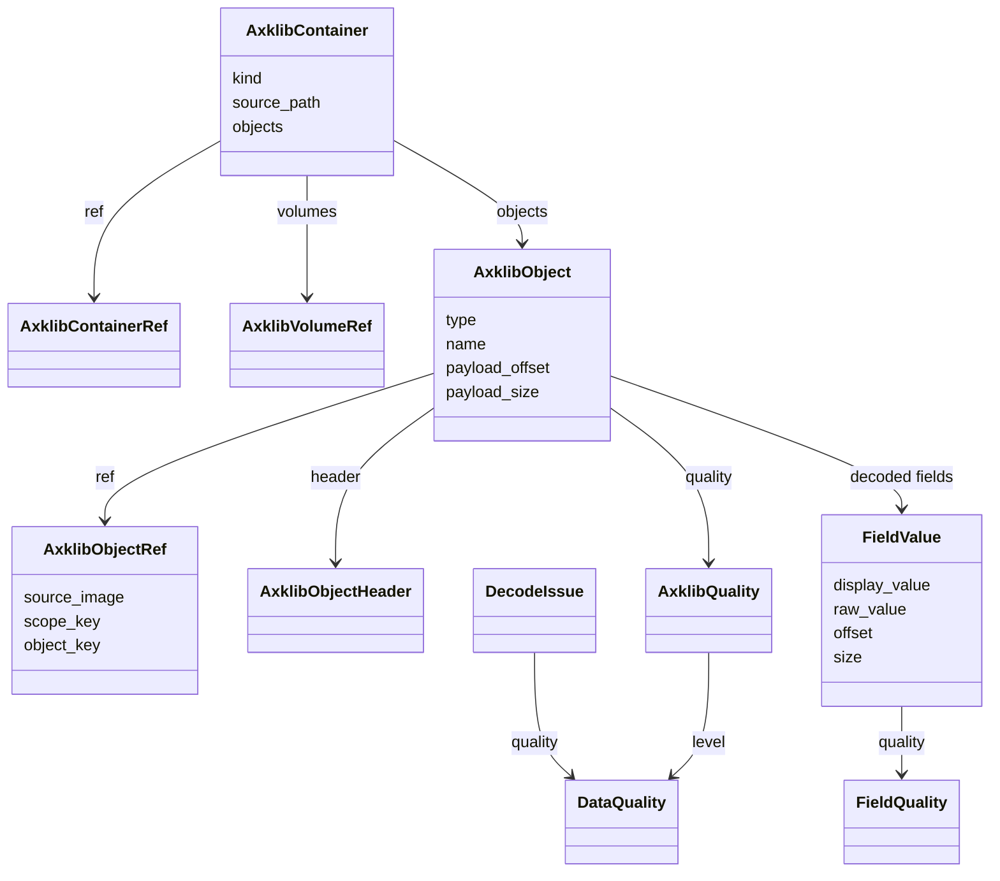

# Data Model

These are the stable model types shared by container readers, relationship
builders, validators, and exporters. They keep object identity, sampler-facing
placement, raw payload origin, and quality labels together.

::: axklib.model
    options:
      members:
        - DataQuality
        - AxklibObjectFormat
        - AxklibObjectType
        - AxklibContainerKind
        - AxklibQuality
        - AxklibContainerRef
        - AxklibVolumeRef
        - AxklibObjectRef
        - AxklibObjectHeader
        - FieldQuality
        - FieldValue
        - DecodeIssue
        - AxklibObject