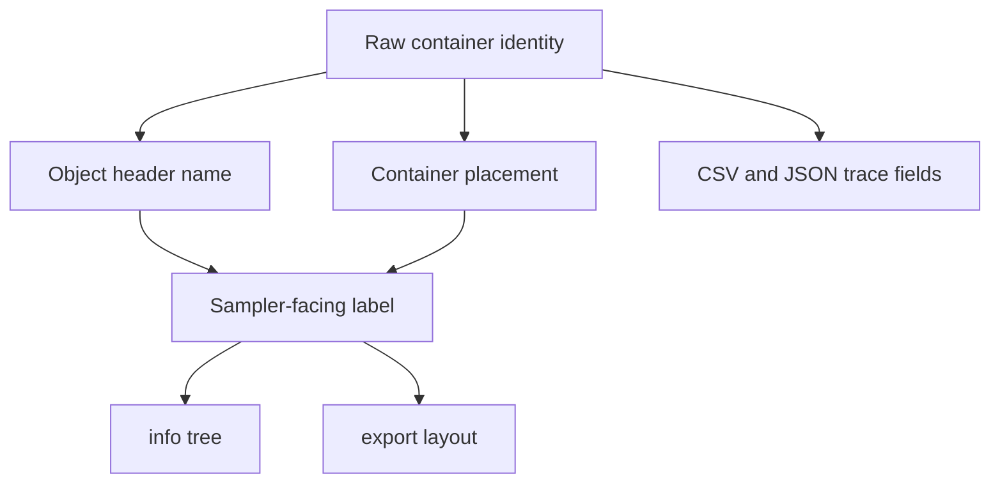

# Name, Path, And Export Mapping

axklib keeps technical identifiers and sampler-facing display names separate.
Technical identifiers make rows stable in CSV/JSON reports. Display names make
`info` output and export folders match the sampler navigation model.

## Text Encodings

CLI arguments and JSON text are UTF-8 on every platform. Unix rejects malformed
argument byte sequences before parsing; Windows receives UTF-16 through
`wmain`, rejects lone surrogates, and converts to UTF-8 without using the active
code page. C++ SDK path inputs are UTF-8 `std::string` values. Invalid text and
embedded NUL path values are rejected before filesystem access.

Native filesystem paths and UTF-8 display/manifest text use explicit conversion
adapters. axklib does not normalize, case-fold, or transliterate Unicode, so
canonically equivalent names remain distinct. Path sanitization is a separate
operation from encoding validation. Yamaha on-disk name fields retain their
documented ASCII/byte decoding rules and are not interpreted as arbitrary
UTF-8.



## Naming Layers

| Layer | Example | Purpose |
| --- | --- | --- |
| Container raw path | `p0:sfs23`, `BANK001.003`, `8F6EB510/F001/PROG/F003` | Stable technical identity. |
| Object header name | `001`, `CFIII DrkTmprd`, `TS-KICK` | Name stored in the object payload header. |
| Program display name | `001: CFGngDrk` | Slot plus Program name read from `PROG+0x078..0x07f`. |
| Sample Bank Group display | `B TS-KICK` | User-facing rendering of an `SBAC` object. |
| Sample Bank display | `TS-KICK` | User-facing rendering of an `SBNK` object. |
| Waveform display | `TS-KICK` | Physical `SMPL` storage name when waveform context is requested. |

## Object Type Labels

`info` renders object types with labels so similarly named objects can be
distinguished.

| Object or node | Display label |
| --- | --- |
| partition | `[PARTITION]` |
| volume | `[VOLUME]` |
| category | `[CATEGORY]` |
| `PROG` | `[PROGRAM]` |
| `SBAC` | `[SAMPLE BANK GROUP]` |
| `SBNK` | `[SAMPLE BANK]` |
| `SMPL` | `[WAVEFORM]` |
| `SEQU` | `[SEQUENCE]` |
| unresolved Program placeholder | `[UNKNOWN]` |

## Program Slot Labels

Program object header names are usually three-digit slot IDs. axklib renders
Program slots as:

```text
NNN: <program display name>
```

The display name is read from `PROG+0x078..0x07f`. If the display name is empty
and the object header name is a valid slot number from 1 through 128, axklib
renders:

```text
NNN: Pgm NNN
```

Default empty Program slots are omitted from normal `info` output. Use
`--show-default-programs` to render the full 128-slot list.

## Sample Bank Group And Member Levels

`SBAC` is rendered as the sampler-visible `B <name>` parent. Its `SBNK` children
are rendered below it when the relationship is a navigable `SBAC_SLOT_TO_SBNK`
row.

Example:

```text
|-- Sample Banks [CATEGORY]
|   `-- B TS-KICK [SAMPLE BANK GROUP]
|       `-- TS-KICK [SAMPLE BANK]
```

Program assignments to a Sample Bank Group display the group, not the underlying
physical waveform objects:

```text
|-- 001: TSUYOSHI [PROGRAM]
|   `-- B TS-KICK [SAMPLE BANK GROUP] - Rch Assign: =SMP
```

`SBNK -> SMPL` links are waveform-storage links. They are used by reports,
validation, and exact export metadata, but they are not displayed as normal
Program assignment children by default.

## SFS Paths

SFS paths come from directory entries:

```text
partition -> volume -> category -> object entry
```

The SFS reader uses directory placement for volumes and categories. Report rows
also keep SFS ID, payload offset, and match method fields.

User-facing SFS tree shape:

```text
|-- partition 0: Main [PARTITION]
|   |-- Piano Volume [VOLUME]
|   |   |-- Programs [CATEGORY]
|   |   |   `-- 001: Grand [PROGRAM]
|   |   `-- Sample Banks [CATEGORY]
|   |       `-- B Grand Bank [SAMPLE BANK GROUP]
```

## FAT12 Floppy Paths

FAT12 floppy object placement starts at the root directory filename. The FAT
filename is a technical field; the sampler-facing object name comes from the
object payload.

```text
fat_file: SINE____.003
object header name: SineWave
info label: SineWave [SAMPLE BANK]
```

Normal floppy tree shape:

```text
|-- FAT root [VOLUME]
|   |-- Sample Banks [CATEGORY]
|   |   `-- SineWave [SAMPLE BANK]
|   `-- Waveforms [CATEGORY]
|       `-- SineWave [WAVEFORM]
```

## CD-ROM Paths

CD-ROM images keep raw ISO folder identity and sampler-facing labels together.

```text
raw path:        8F6EB510/F001/PROG/F003
facing path:     ORGANS/Or11 Argent/Programs/003: Arg Per4
```

Display label precedence:

1. Decoded CD-ROM menu label stored in the ISO.
2. Content-derived fallback from a visible object in the raw folder.
3. Raw ISO folder name.

If the same display label appears more than once in a group, axklib appends the
raw volume suffix:

```text
Or11 Argent (F001)
Or11 Argent (F002)
```

## Content Tree Sorting

Within a category, nodes sort by:

1. unresolved Program placeholders when `--show-unresolved` is active;
2. category order: Programs, Sample Banks, Waveforms, Sequences;
3. Program slot number;
4. display name;
5. object type;
6. object key.

This keeps Program slots numerically stable and makes missing active targets
visible before normal Program children when explicitly requested.

## Program Assignment Details In `info`

Normal `info` output prints assignment details only for displayed active Program
children:

```text
|-- 001: TSUYOSHI [PROGRAM]
|   |-- B TS-BASS [SAMPLE BANK GROUP] - Rch Assign: =SMP
|   `-- TS-FX 7 [SAMPLE BANK] - Rch Assign: =SMP
```

Visible/off rows and duplicate-not-active rows are not printed as active Program
children. They remain in relationship CSV/JSON reports.

When `--show-unresolved` is used, active missing local targets appear as Unknown
placeholders:

```text
|-- 009: India [PROGRAM]
|   |-- INDIAN 7 [UNKNOWN]
|   `-- B India [SAMPLE BANK GROUP] - Rch Assign: =SMP
```

## Export Path Sanitization

Export paths use sampler-facing names, sanitized for normal filesystems.

Rules:

| Input shape | Path behavior |
| --- | --- |
| Empty name | Replaced with a fallback such as `sample` or `unknown_volume`. |
| Invalid path characters `< > : " / \ | ? *` | Replaced with `_`. |
| Control characters | Replaced with `_`. |
| Repeated whitespace | Collapsed to one space in display-path components. |
| Trailing duplicate stars | Converted to numeric suffixes by default: `*` -> ` (2)`, `**` -> ` (3)`. Rendered stereo stems can use an owning sample-bank/group label instead when that is clearer. |
| Repeated `_` | Collapsed. |
| Leading/trailing dots, spaces, `_` | Trimmed from path components. |

## Exact Export Layout

Scoped extraction writes one shared sample pool plus folders for the selected
scope. Use `extract wav file` or `extract sfz file` for whole-input
exports. Use narrower scopes with `--path` values copied from
`info --format paths`.

Typical whole-input export layout:

```text
<output>/
  _samples/
    physical/
      Grand C4__a1b2c3d4e5f6.wav
    rendered/
      Grand Stereo__b1c2d3e4f5a6.wav
  file/
    source-image/
      partition-or-group/
        volume/
          volume.axklib.json
          Instrument.sfz
```

Typical scoped Program export layout:

```text
<output>/
  _samples/
    physical/
    rendered/
  program/
    partition_00_Main/
      Piano Volume/
        Programs/
          001_ Grand/
            Grand.sfz
```

Rules:

| Output | Rule |
| --- | --- |
| `_samples/physical/` | Contains exact physical mono WAV files. |
| `_samples/rendered/` | Contains interleaved stereo WAVs when a compatible pair is rendered. |
| `file/<source>/.../` | Whole-input selection hierarchy, retaining the source name and decoded volume placement. |
| `<scope>/<selector>/` | Narrow selected scope folder. |
| `volume.axklib.json` | Per-volume object and relationship graph written by both WAV and SFZ extraction. |

Physical WAV names come from `SMPL` storage names plus a short content hash so
several selections can share one pool without collisions. They stay
storage-facing even when that produces a filesystem-safe numeric suffix from a
sampler duplicate marker. When a physical waveform is referenced by
sampler-visible `SBNK` members, the graph records those member names in the
`user_facing_aliases` field on the `SMPL` object. Display-oriented consumers
should use the first alias when present and fall back to the physical `SMPL`
display name only when no alias is known.

The suffix is the first 12 lowercase hexadecimal characters of SHA-1 over the
complete emitted WAV container bytes. This 48-bit suffix is retained as an
export-layout compatibility rule, not for security or as sampler metadata. A
single export plan reuses a path only when the full digest and WAV bytes match;
if distinct contents ever share the same shortened path, export fails clearly
instead of overwriting or choosing an order-dependent name.

Rendered stereo names come from sampler-facing sample/member names when a known
stereo relationship supplies a better musical label. For paired sibling `SBNK`
stereo, terminal `-L` and `-R` are removed from the rendered stem, so
`Grand -L` and `Grand -R` render as `Grand.wav` while both physical `SMPL` WAVs
remain present. If the paired member name is only distinguished by a sampler
duplicate marker, the rendered stem uses the owning `B ...` sample-bank or group
label when available, for example `Harpsi 2.1N - Harpsich031.wav` instead of a
numeric duplicate suffix.
## Technical Fields That Stay In Reports

Normal CLI text leads with sampler-facing names. These fields remain available in
CSV/JSON reports for traceability:

| Field family | Examples |
| --- | --- |
| SFS placement | `partition_index`, `sfs_id`, `payload_offset`, `object_offset`. |
| FAT placement | `fat_file`, `fat_directory_offset`, `fat_first_cluster`, `fat_cluster_count`. |
| ISO placement | `iso_raw_group`, `iso_raw_volume`, `iso_extent_sector`, `iso_data_offset`. |
| Relationship diagnostics | `basis`, `raw_fields`, candidate object keys, assignment row bytes. |
| Quality labels | `quality`, `match_quality`, `placement_quality`. |
