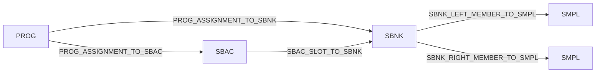

# Relationships

Relationship APIs expose the graph view used by reports, validation, content
trees, and structured audio export. A relationship row is a directed edge from a
source object to a target object, plus the matching method, quality label, raw
row data, and optional Program assignment details.

## Relationship Row Fields

The stable edge type is `Relationship`.

| Field | Meaning |
| --- | --- |
| `key` | Stable relationship row key. |
| `source_key` | Object key of the source object. |
| `target_key` | Object key of the matched target object, or a diagnostic target string for unresolved rows. |
| `relationship_type` | Edge type such as `SBAC_SLOT_TO_SBNK`. |
| `quality` | `Known`, `Likely`, `Tentative`, or `Unknown`. |
| `basis` | Short machine-readable matching method. |
| `raw_fields` | Compact raw row fields kept for diagnostics. |
| `ambiguity_notes` | Human-readable note for ambiguous or unresolved rows. |
| `source_image` | Input source that produced the row. |
| `scope_key` | Container scope used to avoid cross-image key collisions. |
| `assignment_index` | Program assignment row index when applicable. |
| `assignment_name` | Program assignment name when applicable. |
| `assignment_row_state` | Program row decode state, usually `decoded-row`. |
| `active_assignment_state` | Conservative active/off/source-load classification. |
| `assignment_rch_assign_display` | Display family such as `=SMP`, `01`, `BasicRch`, or `off`. |
| `diagnostic_category` | High-level diagnostic grouping for unresolved or reporting-only rows. Empty for ordinary graph edges. |

The relationship graph also carries diagnostic row tables:

| Table | Purpose |
| --- | --- |
| `sbac_sbnk_rows` | Detailed SBAC slot to SBNK matching rows. |
| `prog_bank_rows` | Detailed PROG assignment row matching rows. |
| `prog_ignored_rows` | Decoded PROG rows intentionally excluded from graph edges. |
| `sbnk_bitmap_rows` | SBNK Program-link bitmap comparison rows. |

## Quality Labels

| Label | Public meaning |
| --- | --- |
| `Known` | The row is treated as a normal graph edge by user-facing workflows. |
| `Likely` | The row is useful and may be displayed when the workflow accepts qualified placement. |
| `Tentative` | The row is ambiguous and remains diagnostic. |
| `Unknown` | The row is unresolved or not suitable as an object edge. |

`RelationshipGraph.ambiguous()` returns `Tentative` rows.

## SBAC Slot To SBNK

`SBAC` slot rows connect a visible `B <name>` Sample Bank Group to its `SBNK`
children.

Input fields:

| Source | Field |
| --- | --- |
| `SBAC+0x144` | Active slot count. |
| `SBAC+0x14c + n * 0x14` | Slot row start. |
| slot `+0x00..+0x0f` | SBNK name. |
| slot `+0x10..+0x13` | Raw diagnostic handle. |

Matching methods:

| Method | Quality | Meaning |
| --- | --- | --- |
| `active-sbac-slot-name` | `Known` | Slot name uniquely matches one same-scope `SBNK` name. |
| `active-sbac-slot-name+same-folder` | `Likely` | Duplicate names exist, but exactly one candidate is in the same logical object folder. |
| `active-sbac-slot-name+same-volume` | `Likely` | Duplicate names exist, but exactly one SFS candidate is in the same volume as the Sample Bank Group. |
| `active-sbac-slot-name-ambiguous` | `Tentative` | Multiple same-scope `SBNK` candidates remain. |
| `active-sbac-slot-unmatched` | `Unknown` | No same-scope `SBNK` name matches the slot. |

The raw 32-bit slot handle is retained in reports and is not required for the
public target match.

## PROG Assignment To SBAC Or SBNK

Program assignment rows start at `PROG+0x120` with a `0x38` byte stride. The
assignment kind byte selects the target category currently used by axklib:

| Kind byte | Target category | Relationship type |
| ---: | --- | --- |
| `0x10` | `SBNK` | `PROG_ASSIGNMENT_TO_SBNK` |
| `0x11` | `SBAC` | `PROG_ASSIGNMENT_TO_SBAC` |

Matching methods:

| Method | Quality | Meaning |
| --- | --- | --- |
| `assignment-kind-0x10+name` | `Known` | Direct SBNK assignment name uniquely matches a same-scope `SBNK`. |
| `assignment-kind-0x11+name` | `Known` | SBAC assignment name uniquely matches a same-scope `SBAC`. |
| `assignment-kind-0x10+name+same-folder` | `Likely` | Direct SBNK duplicate names exist, one same-folder candidate remains. |
| `assignment-kind-0x11+name+same-folder` | `Likely` | SBAC duplicate names exist, one same-folder candidate remains. |
| `assignment-kind-0x10+name+same-volume` | `Likely` | Active SFS row has one same-volume SBNK candidate. |
| `assignment-kind-0x11+name+same-volume` | `Likely` | Active SFS row has one same-volume SBAC candidate. |
| `assignment-kind-0x10+name-ambiguous` | `Tentative` | Multiple SBNK candidates remain. |
| `assignment-kind-0x11+name-ambiguous` | `Tentative` | Multiple SBAC candidates remain. |
| `assignment-name-unique` | `Likely` | Name is unique but category selector is not a supported kind. |
| `assignment-name-ambiguous` | `Tentative` | Name matches multiple objects across categories. |
| `assignment-unmatched` | `Unknown` | No target candidate matched. |

Rows that are visible/off or inactive can receive reporting-only method names so
they are not confused with active Program content loss:

| Method family | Meaning |
| --- | --- |
| `assignment-visible-off-missing-local-sbnk` | Visible/off row names a missing SBNK target. |
| `assignment-visible-off-missing-local-sbac` | Visible/off SFS/FAT row names a missing SBAC target. |
| `assignment-visible-off-iso-missing-local-sbac` | Visible/off ISO row names a missing SBAC target. |
| `assignment-visible-off-same-volume-sbac-diagnostic` | Visible/off SBAC row has one same-volume diagnostic candidate plus other duplicate-name candidates. |
| `assignment-visible-off-same-volume-sbnk-diagnostic` | Visible/off SBNK row has one same-volume diagnostic candidate plus other duplicate-name candidates. |
| `assignment-visible-off-name-ambiguous-sbnk` | Visible/off SBNK row has duplicate candidates. |
| `assignment-visible-off-name-ambiguous-sbac` | Visible/off SBAC row has duplicate candidates. |
| `assignment-visible-off-name-ambiguous-smpl-candidates` | Visible/off SBNK row has only duplicate SMPL waveform candidates with the same name. |
| `assignment-visible-off-name-ambiguous-non-target-category` | Visible/off row matches a non-selected category. |
| `assignment-active-missing-local-target` | Active row references a target missing from the local object set. |

Relationship rows also expose `diagnostic_category` for coarse grouping without
parsing every `basis` value:

| Category | Meaning |
| --- | --- |
| `visible-off-assignment` | Decoded Program inventory row with Rch Assign off. Not active Program content. |
| `program-link-bitmap` | SBNK Program-link bitmap consistency diagnostic. |
| `sbnk-member-link` | SBNK member-link diagnostic where link and name values do not fully agree. |
| `active-assignment-missing-target` | Active Program assignment whose named local target is missing. |
| `ambiguous-target` | Generic ambiguous relationship fallback. |
| `missing-target` | Generic unresolved relationship fallback. |

For ordinary `Known` and `Likely` graph edges, `diagnostic_category` is empty.

SBNK member-link diagnostics can use `sbnk-member-link-id-only-name-mismatch`
when a member link ID selects one physical waveform but the member name does not
confirm it. CD-ROM rows can use the more specific
`sbnk-member-link-id-only-iso-cross-folder-name-mismatch` when that waveform is
in another ISO object folder. Both variants remain `Tentative` until the member
name and link agree or another public rule confirms the relationship.

## Active Assignment State

Active/off state is separate from target matching.

| State | Meaning |
| --- | --- |
| `unknown` | No stronger active/off/source-load classification. |
| `confirmed-active` | `PROG` row gate byte indicates an active Program assignment. |
| `confirmed-visible-off` | Row is visible inventory with Rch Assign off. |
| `confirmed-duplicate-not-active` | Duplicate visible row exists but is not the active assignment. |
| `source-load-assignment` | CD-ROM row represents a source-load link rather than hard-disk active/off state. |

Classifier inputs:

| Input | Rule |
| --- | --- |
| `assignment_row_state != decoded-row` | active state is `unknown`. |
| `assignment_rch_assign_gate_byte_0x28 == 0xff` | active state is `confirmed-active`. |
| `assignment_rch_assign_gate_byte_0x28 == 0x00` | active state is `confirmed-visible-off`. |
| CD-ROM matched row with source-load pattern | active state becomes `source-load-assignment`. |

## Rch Assign Display

`assignment_rch_assign_display` is a display family, not a target resolver.

| Gate byte `+0x28` | Channel byte `+0x15` | Display |
| ---: | ---: | --- |
| `0x00` | any | `off` |
| other non-`0xff` value | any | `unknown` |
| `0xff` | `0xff` | `=SMP` |
| `0xff` | `0x00..0x0f` | `01` through `16` |
| `0xff` | `0x10` | `BasicRch` |
| `0xff` | `0x11..0x20` | `B01` through `B16` |

Normal `info` output shows Rch Assign only for displayed active Program
children. More detailed row bytes stay in CSV/JSON reports.

## SBNK To SMPL

`SBNK` member lanes connect sampler-visible sample-bank/member objects to
physical `SMPL` waveform storage.

| Lane | Name field | Link ID field | Relationship type |
| --- | --- | --- | --- |
| left | `SBNK+0x078..0x087` | `SBNK+0x0a0` | `SBNK_LEFT_MEMBER_TO_SMPL` |
| right | `SBNK+0x088..0x097` | `SBNK+0x0a4` | `SBNK_RIGHT_MEMBER_TO_SMPL` |

Known rows are used for exact export sidecars and stereo render planning. Rows
with missing or ambiguous targets remain diagnostic and can raise validation
issues when reachable from active Program assignments.

### Paired SBNK Stereo

Some containers represent stereo as two sampler-visible `SBNK` siblings under
the same `SBAC` group instead of one `SBNK` with a right-member `SMPL` link. The
public rule for rendering this pattern is intentionally narrow:

| Requirement | Rule |
| --- | --- |
| Grouping | Both `SBNK` objects are known members of the same `SBAC`. |
| Names | The sampler-facing `SBNK` names share the same base and differ only by terminal `-L` and `-R`. |
| Waveforms | Each `SBNK` has a known left-member link to a distinct physical `SMPL` object. |
| Export | Exact mono `SMPL` WAVs are still exported once; the stereo WAV is an additional `RENDERED/` artifact. |

The graph records this as a stereo decision with a basis containing
`same-sbac-sbnk-name-lr-pair`. It does not convert the paired `SBNK` objects into
a synthetic right-member link.

## SBNK Program-Link Bitmaps

Each `SBNK` has four 32-bit Program-link bitmap words at `0x0c0..0x0cf`. These
are compared against decoded Program assignment rows and reported in
`sbnk_bitmap_rows`.

Mismatch classes include:

| Class | Meaning |
| --- | --- |
| `match` | Bitmap and direct assignment rows agree. |
| `bitmap_disambiguates_ambiguous_direct_assignment` | Bitmap points to a Program also seen in ambiguous direct rows. |
| `bitmap_without_decoded_direct_assignment` | Bitmap names a Program without a direct decoded assignment. |
| `direct_assignment_also_reached_through_sbac` | Direct assignment also appears through a Sample Bank Group. |
| `nondefault_flag_direct_assignment_without_bitmap` | Direct row lacks a matching bitmap and has a nondefault flag. |
| `known_direct_assignment_missing_bitmap` | Known direct assignment is absent from the bitmap. |
| `mixed:...` | More than one mismatch class applies. |

Tentative bitmap graph rows with non-empty `bitmap_programs` use a basis value of
`sbnk-program-link-bitmap-<mismatch-class>-diagnostic`, where the mismatch class
is converted to hyphenated form. These rows keep `diagnostic_category` set to
`program-link-bitmap`; they do not create Program children or resolve assignment
targets.

## Content Tree Filtering

The relationship graph contains more rows than the default `info` tree displays.
The tree is intentionally sampler-navigable by default.

| Row type | Default `info` behavior |
| --- | --- |
| Active `PROG -> SBAC` or `PROG -> SBNK`, quality `Known` or `Likely` | Displayed as Program child. |
| CD-ROM `source-load-assignment`, quality `Known` or `Likely` | Displayed as Program child. |
| `SBAC -> SBNK`, quality `Known` | Displayed as Sample Bank Group child. |
| `SBNK -> SMPL` | Not shown as a normal Program/Sample Bank tree child. Used for waveform/export metadata. |
| Visible/off Program rows | Not displayed as active Program children. Kept in reports. |
| Active missing local target | Hidden by default; shown as an Unknown placeholder with `info --show-unresolved`. |
| Ambiguous or unknown rows | Kept in reports and validation diagnostics. |

Unresolved placeholders sort before normal Program children when
`--show-unresolved` is used.

## Public API

::: axklib.relationships
    options:
      members:
        - Relationship
        - RelationshipGraph
        - RelationshipGraphLoadResult
        - build_relationship_graph
        - build_relationship_graph_for_loaded_results
        - build_relationship_graph_for_path_results
        - build_relationship_graph_for_paths
        - classify_rch_assign_display
        - classify_active_assignment_state

