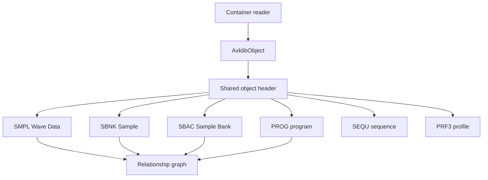

# Sampler Data Structures

Yamaha A-series containers store sampler objects as payload files. axklib reads
the container layer first, then decodes these shared object payloads in the same
way for SFS hard-disk images, FAT12 floppy images, CD-ROM ISO images, standalone
object files, and directory scans.



## Shared Object Header

Supported current object payloads begin with:

```text
FSFSDEV3SPLX<type>
```

Header fields used by axklib:

| Offset | Size | Type | Field | Meaning |
| --- | ---: | --- | --- | --- |
| `0x00` | 12 | ASCII | magic | `FSFSDEV3SPLX`. |
| `0x0c` | 4 | ASCII | type | Object type tag. |
| `0x10` | 4 | u32be | header_size | Object header size. For `SMPL` exact export, this is the stored waveform byte start. |
| `0x14` | 4 | u32be | unknown_0x14 | Preserved diagnostic value. |
| `0x18` | 4 | u32be | record_size_or_header_used | Object-specific compact-record or header-size value surfaced as a raw field. |
| `0x1c` | 4 | u32be | payload_bytes_0x1c | Object payload byte-count field. For `SMPL`, exact export reads this many stored waveform bytes. |
| `0x20` | 4 | u32be | payload_bytes_0x20 | Second object payload byte-count field surfaced for diagnostics. |
| `0x28` | 2 | u16be | sample_rate_guess | `SMPL` sample-rate field. Empty for other types. |
| `0x2a` | 2 | u16be | bytes_per_sample_guess | `SMPL` stored sample width. Empty for other types. |
| `0x32` | 16 | ASCII | name_guess | Object header name, trimmed of trailing NUL and spaces. |

The header parser requires at least `0x42` bytes. Invalid ASCII bytes in names
are replaced with `?`. Empty or padded names are represented as empty strings by
some helper functions and as fallback display names by user-facing renderers.

## Object Type Tags

| Type | Public role |
| --- | --- |
| `SMPL` | Wave Data storage object. Exact mono WAV export reads this level. |
| `SBNK` | Sampler-visible Sample object. Stores Sample parameters and links to Wave Data storage. |
| `SBAC` | Sampler-visible Sample Bank object. User-facing trees render it as `B <name>`. |
| `PROG` | Program object, Program display name, effects, controller data, and assignment rows. |
| `SEQU` | Sequence object. Currently surfaced as an object identity and tree entry. |
| `PRF3` | Profile/preference-style object. Currently surfaced as an object identity; type-specific fields are not public yet. |
| other known tags | Recognized by low-level helpers, but not loaded as normal public objects unless a container reader explicitly supports them. |

## Container Filename Versus Payload Identity

Every object file is complete from byte `0x00`; container allocation does not
replace or remove the shared object header. The container filename locates the
file, while the four-byte tag at payload offset `0x0c` determines its type and
the embedded header supplies its sampler object name.

| Container | Placement filename | Type and display-name source |
| --- | --- | --- |
| FAT12 floppy | DOS 8.3 name such as `AUTHORED.001` | `FSFSDEV3SPLX<type>` and embedded object name. A numeric extension is not a type code. |
| CD-ROM ISO | `<group>/Fnnn/<type>/Fnnn`; category `0000` maps display names to files | Embedded type and name remain authoritative. The category name and catalog are independently checked placement metadata. |
| Standalone file | Host filename chosen by the caller | Entire file begins with the shared magic and type tag. |
| SFS image | SFS directory record and object ID rather than a host filename | Embedded type and name, with SFS placement retained separately. |

`SMPL` and `SBNK` have variable total file sizes. Consumers must use the
big-endian length and offset fields in the object rather than inferring payload
boundaries from a FAT cluster count, ISO extent padding, or an `Fnnn` name.
`SEQU` and `PRF3` can be inventoried and transferred as complete known-type
payloads, but their type-specific inner formats are not part of the current
public decoder contract.

## AxklibObject Identity

Every loaded object is represented as `AxklibObject`. The public identity has
three parts:

| Area | Fields | Meaning |
| --- | --- | --- |
| Container | `source_image`, `kind`, `scope_key` | Which input and container scope produced the object. |
| Object reference | `object_key`, `partition_index`, `sfs_id`, `fat_file`, `payload_offset`, `payload_size` | Stable object key and physical placement hints. |
| Sampler data | `object_type`, `name`, `payload`, `header`, `quality`, `metadata` | Decoded object identity, raw bytes, and container-specific metadata. |

Container-specific placement metadata is documented in the format pages:

| Container | Placement fields |
| --- | --- |
| SFS | partition index, SFS ID, payload offset, payload size, scope key. |
| FAT12 floppy | FAT filename, root directory offset, first cluster, cluster count, file size, object offset. |
| CD-ROM ISO | raw ISO path, group/volume labels, extent sector, data offset, file size, loader-quality fields. |

## SMPL: Wave Data Object

`SMPL` objects are the Wave Data storage level. Exact export writes one mono
WAV per decoded `SMPL` object. Stereo rendering is a separate
operation driven by `SBNK` relationships.

Current compact metadata fields:

| Offset | Size | Type | Field |
| --- | ---: | --- | --- |
| `0x28` | 2 | u16be | sample_rate_guess |
| `0x2a` | 2 | u16be | bytes_per_sample_guess |
| `0x30` | variable | bytes | compact record, reported as `current_smpl_compact_record_hex` |
| `0x54` | 16 | ASCII | source_wave_name_guess |
| `0x6c` | 4 | u32be | smpl_group_id_0x06c |
| `0x78` | 4 | u32be | wave_data_reference_value |
| `0x7c` | 2 | u16be | sample_rate_duplicate_0x07c |
| `0x7e` | 1 | u8 | root_key_midi_note_guess |
| `0x7f` | 1 | s8 | fine_tune_cents_guess |
| `0x85` | 1 | u8 | loop_mode_candidate_0x085 |
| `0x92` | 4 | u32be | wave_length_frames_0x092 |
| `0x96` | 4 | u32be | loop_start_frame_0x096 |
| `0x9a` | 4 | u32be | loop_length_frames_0x09a |

Derived loop values:

```text
loop_end_frame_inclusive_guess = loop_start + loop_length - 1
loop_end_frame_exclusive_guess = loop_start + loop_length
loop_end_frame_a4000_ui_guess  = loop_start + loop_length
```

Loop-mode display values currently surfaced by axklib:

| Raw | Label |
| ---: | --- |
| `0` | `-->` |
| `1` | `->0` |
| `2` | `->0->` |
| `3` | `<--` |
| `4` | `One->` |
| `5` | `One<-` |

PCM export mapping:

| Stored width | Stored bytes | WAV bytes |
| ---: | --- | --- |
| `2` | 16-bit stored samples in big-endian byte order | Byte-swapped to little-endian 16-bit WAV PCM. |
| `1` | 8-bit PCM | Copied directly to WAV frames. |
| `2` with alternating-byte compatibility pattern | Alternating filler bytes with useful high-byte lane | Useful lane is converted to unsigned 8-bit WAV frames and remains a read/export compatibility case. |

`header_size` is the start offset of stored waveform bytes inside the `SMPL`
payload. `payload_bytes_0x1c` is the stored byte count read by exact export.
Generated images may store a short compatibility tail after the logical waveform
frames. In that case the stored byte count includes the tail, while
`wave_length_frames_0x092` and `loop_length_frames_0x09a` describe the logical
sample window.

When the alternating-byte compatibility pattern is detected, audio APIs set
`Waveform.alternating_byte_payload_detected` and sidecars write
`alternating_byte_payload_detected`. In that case `stored_payload_transform` is
`alternating-byte-signed-high-byte`, `exactness_status` is
`alternating-byte-compatibility-export`, and the WAV contains the useful lane as
8-bit PCM. This is a read/export compatibility path; it is not a normal
write-support format.

## SBNK: Sample Object

`SBNK` objects are sampler-visible Samples. They link to Wave Data storage and
carry most Sample parameters.

### Member Resolution Fields

| Offset | Size | Type | Field |
| --- | ---: | --- | --- |
| `0x078` | 16 | ASCII | left member Wave Data name |
| `0x088` | 16 | ASCII | right member Wave Data name |
| `0x098` | 4 | u32be | left runtime handle slot |
| `0x09c` | 4 | u32be | right runtime handle slot |
| `0x0a0` | 4 | u32be | left cached Wave Data reference value |
| `0x0a4` | 4 | u32be | right cached Wave Data reference value |
| `0x0c0` | 4 | u32be | linked Programs 001-032 bitmap |
| `0x0c4` | 4 | u32be | linked Programs 033-064 bitmap |
| `0x0c8` | 4 | u32be | linked Programs 065-096 bitmap |
| `0x0cc` | 4 | u32be | linked Programs 097-128 bitmap |

The A4000 resolves each active member by its 16-byte Wave Data name.
After lookup it writes a runtime handle to `+0x098/+0x09c` and copies the
resolved object's `SMPL+0x078` value into `+0x0a0/+0x0a4`. The latter fields
are therefore cached metadata, not authoritative object identifiers. Real
source media contains stale cached values that disagree with the local named
target and still loads on hardware.

axklib treats a unique local member-name match as `Known`, whether or not its
cache agrees. Duplicate local names remain `Tentative`; a cached-value-only
match is diagnostic and never creates a resolved relationship. Mutation and
package relocation refresh the cache from the selected named Wave Data object.
For a placed Sample, a unique same-scope name whose Wave Data placement is
unresolved remains `Tentative`: exact recovery metadata may retain that
candidate, but it does not project the Sample or Wave Data into a logical
volume. Standalone objects without a placement hierarchy can still resolve by
one unique same-scope name.

The ordinary stereo layout uses the left and right member fields on one
`SBNK`. Some source media instead stores stereo as two sibling `SBNK` objects
under the same `SBAC` Sample Bank, with sampler-facing names ending in `-L` and `-R`.
In that layout each sibling still uses its own left-member Wave Data name. axklib
keeps both `SBNK` objects and both physical `SMPL` exports, then writes an
additive rendered stereo WAV when the sibling names and links are known and
compatible.

Program-link bitmap decoding:
```text
for word_index in 0..3:
    base_program = word_index * 32 + 1
    for bit_index in 0..31:
        if word & (1 << bit_index):
            linked_program = base_program + bit_index
```

### Sample Parameter Window

The sample parameter window starts at `0x0a8`. The table below lists the public
field names currently exposed by the decoder.

| Offset | Type | Field |
| --- | --- | --- |
| `0x0d0` | u8 | sample_flags_0x0d0 |
| `0x0d1` | u8 | mapout_flags_0x0d1 |
| `0x0d2` | u8 | midi_receive_channel_0x0d2 |
| `0x0d3` | u8 | pitch_bend_type_0x0d3 |
| `0x0d4` | u8 | pitch_bend_range_0x0d4 |
| `0x0d5` | u8 | coarse_tune_0x0d5 |
| `0x0d6` | u8 | left_root_key_0x0d6 |
| `0x0d7` | u8 | right_root_key_0x0d7 |
| `0x0d8` | u16be | left_sample_rate_0x0d8 |
| `0x0da` | u16be | right_sample_rate_0x0da |
| `0x0dc` | s8 | left_fine_tune_cents_0x0dc |
| `0x0dd` | s8 | right_fine_tune_cents_0x0dd |
| `0x0de` | u16be | pitch_base_word_0x0de |
| `0x0e0` | u16be | secondary_pitch_base_word_0x0e0 |
| `0x0e2` | u8 | key_range_high_0x0e2 |
| `0x0e3` | u8 | key_range_low_0x0e3 |
| `0x0e6` | u16be | loop_tempo_0x0e6 |

Key-range values `0..127` are concrete MIDI key limits. The sampler also
uses direction-specific sentinel bytes for the UI value `Orig`: raw `128` in
`key_range_high_0x0e2` and raw `255` in `key_range_low_0x0e3`. axklib
preserves those raw values and exposes a `resolved_key_range` projection in
volume graphs. The projection resolves `Orig` to the member root key so export
formats with only concrete MIDI limits can emit bounded zones. Generated direct
single-member `SBNK` objects have been hardware-tested with concrete root key
and key-range values. For a single-member Sample, an empty right member name means
there is no active right member; the generated writer treats right-member fields
as inactive compatibility fields rather than as a second playback region.

| Offset | Type | Field |
| --- | --- | --- |
| `0x0e8` | u32be | left_wave_start_address_0x0e8 |
| `0x0ea` | u16be | left_wave_start_low16_0x0ea |
| `0x0ec` | u32be | right_wave_start_address_0x0ec |
| `0x0ee` | u16be | right_wave_start_low16_0x0ee |
| `0x0f0` | u32be | left_wave_length_frames_0x0f0 |
| `0x0f4` | u32be | right_wave_length_frames_0x0f4 |
| `0x0f8` | u32be | left_loop_start_frame_0x0f8 |
| `0x0fc` | u32be | right_loop_start_frame_0x0fc |
| `0x100` | u32be | left_loop_length_frames_0x100 |
| `0x104` | u32be | right_loop_length_frames_0x104 |
| `0x108` | u8 | start_address_velocity_sensitivity_0x108 |
| `0x109` | u8 | filter_type_0x109 |
| `0x10a` | u8 | filter_cutoff_0x10a |
| `0x10b` | u8 | filter_q_width_0x10b |
| `0x10c` | u8 | filter_cutoff_key_scaling_break1_0x10c |
| `0x10d` | u8 | filter_cutoff_key_scaling_break2_0x10d |
| `0x10e` | u8 | filter_cutoff_key_scaling_level1_0x10e |
| `0x10f` | u8 | filter_cutoff_key_scaling_level2_0x10f |
| `0x110` | u8 | filter_cutoff_velocity_sensitivity_0x110 |
| `0x111` | u8 | filter_q_width_velocity_sensitivity_0x111 |
| `0x112` | u8 | expand_detune_0x112 |
| `0x113` | u8 | expand_dephase_0x113 |
| `0x114` | u8 | expand_width_0x114 |
| `0x115` | u8 | random_pitch_0x115 |
| `0x116` | u8 | sample_level_0x116 |

Generated direct single-member `SBNK` objects have been hardware-tested with
sample level values in the normal `0..127` range. The writer also carries a
conservative current-format default set for fields that are not yet surfaced as
public write inputs, including filter, envelope, LFO, output, portamento, and
sample-control defaults for this direct single-member scope.

The Yamaha Sample Parameter table labels decimal offsets `0170..0179` as
reserved. With the current `0x0a8` Sample Parameter base, those reserved bytes
map to `SBNK+0x152..0x15b`. Hardware-tested generated direct single-member
`SBNK` objects require compatible values in this reserved range: `0x152..0x156`
gates audible playback, and `0x158..0x15b` restores the normal unfiltered tone
for this writer scope.

| Offset | Type | Field |
| --- | --- | --- |
| `0x117` | u8 | pan_0x117 |
| `0x118` | u8 | velocity_low_limit_0x118 |
| `0x119` | u8 | velocity_offset_0x119 |
| `0x11a` | u8 | velocity_range_high_0x11a |
| `0x11b` | u8 | velocity_range_low_0x11b |
| `0x11c` | u8 | level_scaling_break1_0x11c |
| `0x11d` | u8 | level_scaling_break2_0x11d |
| `0x11e` | u8 | level_scaling_level1_0x11e |
| `0x11f` | u8 | level_scaling_level2_0x11f |
| `0x120` | u8 | velocity_sensitivity_0x120 |
| `0x121` | u8 | alternate_group_0x121 |
| `0x122` | u8 | sample_eq_frequency_0x122 |
| `0x123` | u8 | sample_eq_gain_0x123 |
| `0x124` | u8 | sample_eq_width_0x124 |
| `0x125` | u8 | filter_cutoff_distance_0x125 |
| `0x126` | u8 | feg_attack_rate_0x126 |
| `0x127` | u8 | feg_decay_rate_0x127 |
| `0x128` | u8 | feg_release_rate_0x128 |
| `0x129` | u8 | feg_init_level_0x129 |
| `0x12a` | u8 | feg_attack_level_0x12a |
| `0x12b` | u8 | feg_sustain_level_0x12b |
| `0x12c` | u8 | feg_release_level_0x12c |
| `0x12d` | u8 | feg_rate_key_scaling_0x12d |
| `0x12e` | u8 | feg_rate_velocity_sensitivity_0x12e |
| `0x12f` | u8 | feg_attack_level_velocity_sensitivity_0x12f |
| `0x130` | u8 | feg_level_velocity_sensitivity_0x130 |
| `0x131` | u8 | peg_attack_rate_0x131 |
| `0x132` | u8 | peg_decay_rate_0x132 |
| `0x133` | u8 | peg_release_rate_0x133 |
| `0x134` | u8 | peg_init_level_0x134 |
| `0x135` | u8 | peg_attack_level_0x135 |
| `0x136` | u8 | peg_sustain_level_0x136 |
| `0x137` | u8 | peg_release_level_0x137 |
| `0x138` | u8 | peg_rate_key_scaling_0x138 |
| `0x139` | u8 | peg_rate_velocity_sensitivity_0x139 |
| `0x13a` | u8 | peg_level_velocity_sensitivity_0x13a |
| `0x13b` | u8 | peg_range_0x13b |
| `0x13c` | u8 | aeg_attack_rate_0x13c |
| `0x13d` | u8 | aeg_decay_rate_0x13d |
| `0x13e` | u8 | aeg_release_rate_0x13e |
| `0x141` | u8 | aeg_sustain_level_0x141 |
| `0x143` | u8 | aeg_attack_mode_0x143 |
| `0x144` | u8 | aeg_rate_key_scaling_0x144 |
| `0x145` | u8 | aeg_rate_velocity_sensitivity_0x145 |
| `0x146` | u8 | lfo_wave_0x146 |
| `0x147` | u8 | lfo_speed_0x147 |
| `0x148` | u8 | lfo_delay_time_0x148 |
| `0x149` | u8 | lfo_flags_0x149 |
| `0x14a` | u8 | lfo_cutoff_mod_depth_0x14a |
| `0x14b` | u8 | lfo_pitch_mod_depth_0x14b |
| `0x14c` | u8 | lfo_amp_mod_depth_0x14c |
| `0x151` | s8 | filter_gain_0x151 |
| `0x152..0x156` | 5 bytes | single_member_reserved_playback_default_0x152_0x156 |
| `0x158..0x15b` | 4 bytes | single_member_reserved_tone_default_0x158_0x15b |
| `0x15c` | u32be | wave_end_address_0x15c |
| `0x160` | u32be | loop_end_address_0x160 |
| `0x17c` | u8 | velocity_xfade_high_0x17c |
| `0x17d` | u8 | velocity_xfade_low_0x17d |
| `0x17e` | u8 | output1_0x17e |
| `0x17f` | u8 | output1_level_0x17f |
| `0x180` | u8 | output2_0x180 |
| `0x181` | u8 | output2_level_0x181 |
| `0x182` | u8 | sample_portamento_type_0x182 |
| `0x183` | u8 | sample_portamento_rate_0x183 |
| `0x184` | u8 | sample_portamento_time_0x184 |

Sample control records are six 4-byte records at:

```text
record_offset = 0x0a8 + 0xbc + (record_index - 1) * 4
```

Each record stores `device_u8`, `function_u8`, `type_u8`, and signed `range_s8`.

## SBAC: Sample Bank Object

`SBAC` objects are shown as `B <name>` Sample Banks in user-facing trees. They
contain member rows that point by name to Sample (`SBNK`) objects.

| Offset | Size | Type | Field |
| --- | ---: | --- | --- |
| `0x040..0x11f` | 224 | bytes | sample_parameter_block_raw_0x040_0x11f |
| `0x120..0x12b` | 12 | 3 x u32be | value_enable_words_0x120_0x12b |
| `0x130` | 1 | u8 | bulk_assigned_sample_count_0x130 |
| `0x144` | 1 | u8 | active_slot_count_0x144 |
| `0x14c` | variable | rows | First SBAC member slot row. |

SBAC value-enable bitmap decoding:

```text
for word_index in 0..2:
    base_p2 = word_index * 32
    for bit in 0..31:
        if word & (1 << bit):
            enabled_sample_parameter_p2 = base_p2 + bit
```

SBAC slot row layout, stride `0x14`:

| Row offset | Size | Type | Field |
| --- | ---: | --- | --- |
| `+0x00` | 16 | ASCII | slot SBNK name |
| `+0x10` | 4 | u32be | raw_handle_0x10 |

The current reader uses `active_slot_count_0x144` to decide how many rows to
read, capped by the payload size. The 32-bit handle is retained as a diagnostic
field. It is opaque source-local state rather than a portable object identity.
Package export declares each active row handle as a relocation, and package
import writes the hardware-proven zero form while preserving the row order and
resolved member name. Target matching uses exact name, object type, and local
placement before it emits a resolved relationship.

## PROG: Program Object

`PROG` objects represent Program slots. The object header name is normally a
three-digit slot ID. The displayed Program name is read from payload
`0x078..0x07f`; if that field is empty, axklib displays `Pgm NNN` for slots
1 through 128.

### Program Common Fields

| Offset | Size | Type | Field |
| --- | ---: | --- | --- |
| `0x068..0x077` | 16 | bytes | raw_0x068_0x077 |
| `0x080` | 1 | u8 | program_flags_ad_source_effect_connection_lfo_sync_0x080 |
| `0x081` | 1 | u8 | program_lfo_cycle_wave_initial_phase_0x081 |
| `0x082..0x085` | 4 | bytes | raw_0x082_0x085 |
| `0x086` | 1 | u8 | raw_0x086_u8 |
| `0x087..0x08a` | 4 | bytes | raw_0x087_0x08a |
| `0x08f` | 1 | u8 | program_lfo_reset_midi_channel_0x08f |
| `0x090` | 1 | u8 | program_portamento_type_0x090 |
| `0x091` | 1 | u8 | program_portamento_rate_0x091 |
| `0x092` | 1 | u8 | program_portamento_time_0x092 |
| `0x093` | 1 | u8 | sample_and_hold_speed_0x093 |
| `0x094` | 1 | u8 | program_lfo_tempo_0x094 |
| `0x095` | 1 | u8 | program_lfo_reset_note_0x095 |
| `0x096..0x097` | 2 | bytes | raw_0x096_0x097 |
| `0x110..0x11f` | 16 | 4 records | Program controller records. |
| `0x358..0x367` | 16 | bytes | control_tail_raw_0x358_0x367 |

Program controller records are 4-byte rows: `device_u8`, `function_u8`,
`type_u8`, and signed `range_s8`.

### Program Effect Blocks

Program effect blocks start at `0x098`, `0x0c0`, and `0x0e8`. Each block is
`0x28` bytes.

| Block offset | Size | Type | Field |
| --- | ---: | --- | --- |
| `+0x00` | 1 | u8 | active_or_bypass_u8 |
| `+0x01` | 1 | u8 | input_level_u8 |
| `+0x02` | 1 | u8 | output_level_u8 |
| `+0x03` | 1 | s8 | pan_s8 |
| `+0x04` | 1 | u8 | output_u8 |
| `+0x05` | 1 | s8 | width_raw_s8 |
| `+0x06` | 1 | u8 | type_u8 |
| `+0x07` | 1 | u8 | type_mirror_or_reserved_u8 |
| `+0x08` | 32 | 16 x u16be | effect parameter words |

`width_display` is calculated as `width_raw_s8 + 63` when the result is in the
accepted display range.

### Program Assignment Rows

Program assignment rows start at `0x120` and use a `0x38` byte stride.

| Row offset | Size | Type | Field |
| --- | ---: | --- | --- |
| `+0x00` | 16 | ASCII | assignment_name |
| `+0x10` | 4 | u32be | assignment_raw_handle_or_selector |
| `+0x14` | 1 | u8 | assigned_object_type |
| `+0x15` | 1 | u8 | midi_receive_channel_assign |
| `+0x16` | 1 | u8 | level_offset |
| `+0x17` | 1 | u8 | velocity_sensitivity |
| `+0x18` | 1 | u8 | pan_offset |
| `+0x19` | 1 | u8 | velocity_xfade_high_offset |
| `+0x1a` | 1 | u8 | fine_tune_offset |
| `+0x1b` | 1 | u8 | velocity_xfade_low_offset |
| `+0x1c` | 1 | u8 | coarse_tune_offset |
| `+0x1d` | 1 | u8 | output1 |
| `+0x1e` | 1 | u8 | key_limit_high |
| `+0x1f` | 1 | u8 | key_limit_low |
| `+0x20` | 1 | u8 | key_range_shift |
| `+0x21` | 1 | u8 | velocity_limit_high |
| `+0x22` | 1 | u8 | velocity_limit_low |
| `+0x23` | 1 | u8 | portamento_mono_key_xfade_flags |
| `+0x24` | 1 | u8 | alternate_group_number |
| `+0x25` | 1 | u8 | aeg_attack_rate_offset |
| `+0x26` | 1 | u8 | aeg_decay_rate_offset |
| `+0x27` | 1 | u8 | aeg_release_rate_offset |
| `+0x28` | 1 | u8 | output2 / active-state gate |
| `+0x29` | 1 | u8 | filter_cutoff_offset |
| `+0x2a` | 1 | u8 | filter_gain_offset |

For named kind-`0x10` direct-SBNK and kind-`0x11` SBAC assignments, the 32-bit
handle is opaque source-local state rather than a portable object identity.
Package export declares it as a relocation, and package import writes the
hardware-proven zero form while preserving the assignment ordinal, target name,
kind, channel, and remaining row bytes. Empty rows and other assignment kinds
are not covered by this relocation profile.

| Row offset | Size | Type | Field |
| --- | ---: | --- | --- |
| `+0x2b` | 1 | u8 | filter_q_width_offset |
| `+0x2c` | 1 | u8 | cutoff_distance_offset |
| `+0x2d..0x2e` | 2 | bytes | reserved_0045_0046 |
| `+0x2f` | 1 | u8 | output1_level_offset |
| `+0x30..0x31` | 2 | bytes | reserved_0048_0049 |
| `+0x32` | 1 | u8 | output2_level_offset |
| `+0x33` | 1 | u8 | midi_control_on |
| `+0x34` | 1 | u8 | reserved_0052 |
| `+0x35..0x37` | 3 | bytes | reserved_0053_0055 |

Assignment kind byte mapping currently used for read-side relationship matching:

| Kind byte | Target category |
| ---: | --- |
| `0x10` | `SBNK` direct assignment target |
| `0x11` | `SBAC` Sample Bank target |

Rch Assign display family:

| Gate byte `+0x28` | Channel byte `+0x15` | Display |
| ---: | ---: | --- |
| `0x00` | any | `off` |
| not `0x00` or `0xff` | any | `unknown` |
| `0xff` | `0xff` | `=SMP` |
| `0xff` | `0x00..0x0f` | `01` through `16` |
| `0xff` | `0x10` | `BasicRch` |
| `0xff` | `0x11..0x20` | `B01` through `B16` |

Active assignment state is separate from target matching:

| State | Meaning |
| --- | --- |
| `decoded-row` | A row was decoded. |
| `confirmed-active` | Gate byte indicates an active Program assignment. |
| `confirmed-visible-off` | The inventory row is visible but Rch Assign is off. |
| `confirmed-duplicate-not-active` | A duplicate row exists but is not the active assignment. |
| `source-load-assignment` | CD-ROM source-load row matched to a target object. |
| `unknown` | State is not classified beyond diagnostics. |

Normal `info` output shows active Program children and CD-ROM source-load
children that are suitable for user-facing display. CSV and JSON relationship
reports keep all decoded rows, raw selector values, and inactive rows.

Portable-package closure has a separate preservation rule: Known named
kind-`0x10` and kind-`0x11` targets in `confirmed-visible-off` state are retained
because imported zero-handle assignments re-parse in that state and remain
loadable on hardware. `confirmed-duplicate-not-active`, unresolved, and
ambiguous rows remain diagnostic-only.

Relationship target matching is reported separately from active/off state. Rows
that are useful for diagnostics but should not become normal Program children use
`diagnostic_category` values such as `visible-off-assignment`,
`program-link-bitmap`, `sbnk-member-cache`, or
`active-assignment-missing-target`.

## SEQU And PRF3

`SEQU` and `PRF3` are loaded as supported object identities when their payloads
use the shared header. Current public behavior preserves object name, type,
placement metadata, raw payload bytes, and report identity fields. Type-specific
parameter sections are not currently exposed as public fields.

## Relationship Graph

The shared relationship graph connects decoded objects:

| Relationship | Meaning |
| --- | --- |
| `PROG_ASSIGNMENT_TO_SBAC` | Program assignment to a visible `B <Sample Bank>` parent. |
| `PROG_ASSIGNMENT_TO_SBNK` | Program assignment directly to a Sample. |
| `SBAC_SLOT_TO_SBNK` | Sample Bank-to-Sample member row. |
| `SBNK_LEFT_MEMBER_TO_SMPL` | Left member Wave Data storage link. |
| `SBNK_RIGHT_MEMBER_TO_SMPL` | Right member Wave Data storage link. |

Relationship row fields are documented in [Report Schemas](report-schemas.md).

## Exact Export Metadata

Exact export keeps physical and rendered audio separate:

| Output | Source level | Meaning |
| --- | --- | --- |
| `_samples/physical/*.wav` | `SMPL` | Exact mono Wave Data export. |
| `_samples/rendered/*.wav` | linked `SBNK` pair | Interleaved stereo render when left/right members are compatible. |
| optional selection graph JSON | objects and relationships | Scoped graph metadata for objects, relationships, WAV references, quality labels, and diagnostics. |

The original `SMPL` objects remain represented even when a rendered stereo WAV is
created.
