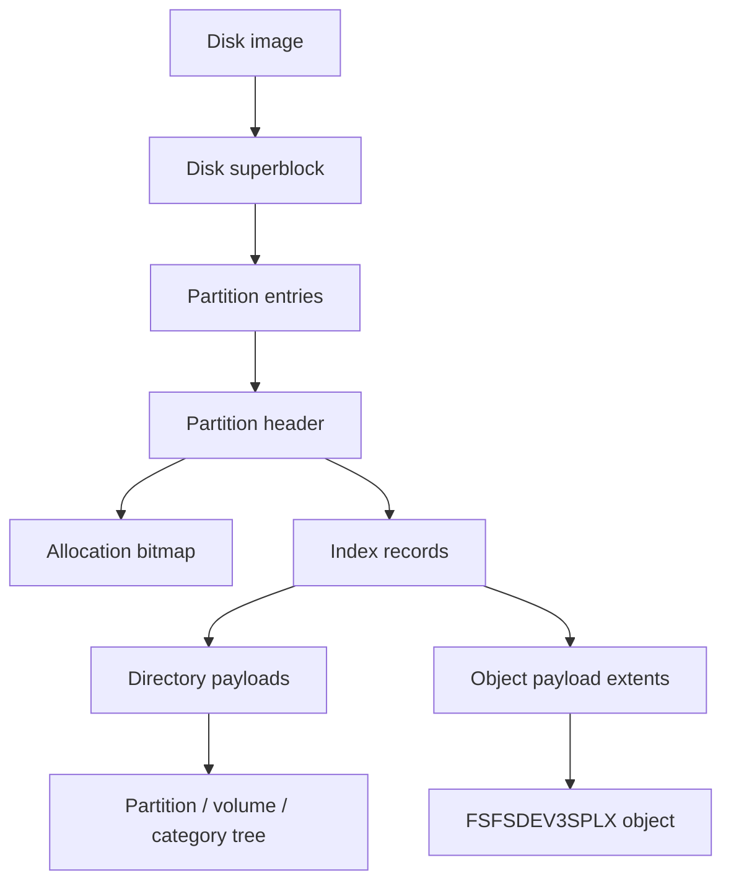

# SFS Filesystem

Yamaha A-series hard-disk images use an SFS container for partitions, directories,
object files, and allocation state. axklib reads this layer before it decodes the
sampler object payloads described in [Sampler Data Structures](sampler-data.md).

SFS is the hard-disk container family used by `.hda`, `.hds`, and equivalent raw
hard-disk images. It is not FAT12 and it is not ISO9660. FAT12 floppies and
CD-ROM images can carry the same sampler object payloads, but their container
layers are different.



## Byte Order And Units

SFS container numeric fields used by axklib are big-endian. Disk locations in the
SFS headers are sector or cluster indexes; axklib converts them to byte offsets
when reading an image.

Common units:

| Unit | Size or rule |
| --- | --- |
| Sector | Stored in the disk superblock, commonly `512` bytes. |
| Cluster | `sector_size * sectors_per_cluster`; commonly two sectors. |
| Index record | `72` bytes. |
| Index block | `1024` bytes, with 14 usable records and 16 bytes of overhead. |
| Directory entry | `32` bytes in current directory payloads. |
| Extent triplet | `12` bytes. |

## Disk Superblock

An SFS disk image starts with a superblock. The second sector stores a duplicate
copy. axklib uses the first copy for normal reads and reports duplicate/header
problems through validation.

| Offset | Size | Type | Meaning |
| --- | ---: | --- | --- |
| `0x000` | 11 | ASCII | Disk signature `YAMAHA_dev3`. |
| `0x00b` | 117 | bytes | Reserved area; the public reader does not interpret it. |
| `0x080` | 28 | bytes | Disk mode/device metadata area; surfaced only as raw structure when inspected. |
| `0x09c` | 4 | u32be | Sector size in bytes. |
| `0x0a0` | 4 | u32be | Total sector count in the image. |
| `0x0a4` | 4 | u32be | Reserved value; the public reader does not interpret it. |
| `0x0a8` | 64 | table | Eight partition entries, each 8 bytes. |
| `0x0e8` | 280 | bytes | Reserved area; the public reader does not interpret it. |

Partition entry layout:

| Entry offset | Size | Type | Meaning |
| --- | ---: | --- | --- |
| `+0x00` | 4 | u32be | Partition start sector. |
| `+0x04` | 4 | u32be | Partition sector count. |

A partition entry is active when both values are non-zero. Fresh generated
images also populate the observed disk mode metadata area so the duplicate
superblocks match sampler-authored hard-disk images of the same size class.

A-series hard-disk images also use sector 2, and for multiple partitions the
sectors immediately before later partitions, as auxiliary formatter-transfer
sectors. Their leading eight bytes are deterministic transfer tokens from
`ab432100` through `ab432107`; the low three bits carry the partition sequence,
and the remaining token bits are compatibility values rather than disk geometry
or persistent disk IDs. Generated images zero prior-token residue at
`+0x09..+0x10`.
axklib does not expose these sectors as part of the directory or object tree.
Older label-entry marker/name records in them are intentionally zero-generated;
they are not required for hardware loading.

## Partition Header

Each active partition starts at its partition start sector. The partition header
is 1024 bytes and is followed by a duplicate copy.

| Offset | Size | Type | Meaning |
| --- | ---: | --- | --- |
| `0x000` | 11 | ASCII | Partition signature `YAMAHA_dev3`. |
| `0x040` | 16 | ASCII | Partition name, space-padded. |
| `0x080` | 4 | u32be | Static or mode value; currently not interpreted by public APIs. |
| `0x084` | 4 | u32be | Static or mode value; currently not interpreted by public APIs. |
| `0x088` | 8 | bytes | Reserved bytes; currently not interpreted by public APIs. |
| `0x090` | 4 | u32be | Number of clusters in the partition. |
| `0x094` | 4 | u32be | Sectors per cluster. |
| `0x098` | 4 | u32be | Header-related value; currently surfaced only as raw structure. |
| `0x09c` | 4 | u32be | Cluster offset to the allocation bitmap. |
| `0x0a0` | 4 | u32be | Reserved value; currently not interpreted by public APIs. |
| `0x0a4` | 4 | u32be | Cluster offset to the directory/file index. |
| `0x0a8` | 4 | u32be | Reserved value; currently not interpreted by public APIs. |

For generated images, the full primary and duplicate 1024-byte partition-header
sectors are part of the write contract. The named fields above are sufficient
for ordinary parsing, but hardware loading also depends on initialized metadata
bytes in the otherwise uninterpreted header area. Do not synthesize those header
sectors by writing only the named fields and leaving the remaining bytes zero.

Cluster offsets are partition-relative. Convert a cluster offset to an absolute
byte offset with:

```text
absolute_sector = partition_start_sector + cluster_offset * sectors_per_cluster
absolute_offset = absolute_sector * sector_size
```

## Allocation Bitmap

The allocation bitmap starts at the partition header field `0x09c`. It stores one
bit per cluster. A set bit means the cluster is allocated; a clear bit means it
is free.

```text
bitmap_offset = (partition_start_sector
                 + bitmap_cluster_offset * sectors_per_cluster)
                * sector_size

bitmap_bytes = ceil(number_of_clusters / 8)
byte_index   = cluster_offset // 8
bit_mask     = 0x80 >> (cluster_offset & 7)
allocated    = (bitmap[byte_index] & bit_mask) != 0
```

Validation reconstructs a second bitmap from all valid index-record extents,
then compares it with the stored bitmap:

| Direction | Meaning |
| --- | --- |
| `stored_used_not_reconstructed` | Stored bitmap marks a cluster used, but no valid index record owns it. |
| `reconstructed_used_not_stored` | A valid index record owns a cluster that is clear in the stored bitmap. |

Mismatch reports use inclusive cluster ranges so large gaps can be reviewed
without listing every cluster.

A-series 256 MiB images also carry an early mirror of the first
allocation-bitmap sector immediately after the duplicate partition header.
Generated images write that mirror as well, while the partition header field
`0x09c` remains the authoritative primary bitmap location for reads and
validation.

## Free Space

SFS free space excludes both the reserved metadata prefix and clusters marked
used in the allocation bitmap:

```text
first_payload_cluster = directory_index_cluster + directory_index_span
free_clusters = cluster_count - first_payload_cluster - allocated_clusters
free_bytes = free_clusters * sectors_per_cluster * sector_size
sampler_visible_free_kib = free_bytes // 1024
```

Use the native function for the same calculation in applications:

```cpp
auto space = axk::calculate_sfs_free_space(1'048'575, 616, 65, 512);
assert(space && space->sampler_visible_free_kib == 1'047'894);
```

`axklib validate` allocation summaries include `first_payload_cluster`,
`reserved_cluster_count`, `sampler_free_cluster_count`, `sampler_free_bytes`,
and `sampler_visible_free_kib`. Impossible geometry returns a typed error
instead of negative capacity.

## Directory And File Index

The directory/file index starts at partition header field `0x0a4`:

```text
index_offset = (partition_start_sector
                + index_cluster_offset * sectors_per_cluster)
               * sector_size
```

The index is divided into 1024-byte blocks. Each block contains 14 records of 72
bytes; the final 16 bytes are block overhead.

```text
record_offset_in_index = (sfs_id // 14) * 1024 + (sfs_id % 14) * 72
absolute_record_offset = index_offset + record_offset_in_index
```

The inverse mapping is:

```text
block = record_offset_in_index // 1024
slot  = (record_offset_in_index % 1024) // 72
sfs_id = block * 14 + slot
```

Offsets inside the 16-byte block overhead are not records.

## Index Record Layout

axklib treats an index slot as a valid extent record when the structural fields
form a readable object or directory payload. The record format used for data
reads is:

| Record offset | Size | Type | Meaning |
| --- | ---: | --- | --- |
| `0x00` | 2 | u16be | Extent count. |
| `0x02` | 2 | u16be | Reserved or flags; current valid data records use zero here. |
| `0x04` | 2 | u16be | Total cluster count. |
| `0x06` | 4 | u32be | Logical data size in bytes. |
| `0x0a` | 4 | u32be | First data cluster for direct records, or continuation-list cluster for multi-extent records. |
| `0x0e` | 4 | u32be | First direct extent cluster count for direct records. |
| `0x12` | 4 | u32be | First direct extent byte count for direct records. |
| `0x42` | bytes | flags | Diagnostic record type/flag area; current public data reads do not require this field. |

The data-size field is the number of logical bytes to return to the object or
directory decoder. Allocated storage can be larger because cluster allocation is
rounded up to full clusters.

## Direct Extents

Records with one to four extents store extent triplets directly in the index
record. Triplets start at `0x0a` and have this layout:

| Triplet offset | Size | Type | Meaning |
| --- | ---: | --- | --- |
| `+0x00` | 4 | u32be | Cluster offset. |
| `+0x04` | 4 | u32be | Cluster count. |
| `+0x08` | 4 | u32be | Byte count to read from this extent. |

Direct read algorithm:

```text
remaining = record.total_data_size
for each direct extent in order:
    capacity = extent.cluster_count * sectors_per_cluster * sector_size
    read_size = min(extent.byte_count, capacity, remaining)
    append bytes from cluster_absolute_offset(extent.cluster_offset)
    remaining -= read_size
```

If the assembled byte count differs from `total_data_size`, validation reports a
logical read mismatch.

## Continuation Extents

Records with five or more extents use a continuation-list cluster. The index
record field at `0x0a` points to the first list cluster. Each continuation-list
cluster is allocated storage and starts with this layout:

| Offset | Size | Type | Meaning |
| --- | ---: | --- | --- |
| `0x00` | 4 | u32be | Number of triplets in this list cluster. |
| `0x04` | 4 | u32be | List bookkeeping value. |
| `0x08` | 4 | u32be | Next list cluster, or zero at the end. |
| `0x0c` | variable | triplets | 12-byte extent triplets. |

Continuation read algorithm:

```text
list_cluster = record.first_cluster
remaining_triplets = record.extent_count
while list_cluster != 0 and remaining_triplets > 0:
    read one cluster at list_cluster
    read triplet_count and next_list_cluster
    append triplets at +0x0c
    mark list_cluster allocated
    list_cluster = next_list_cluster
```

The reader stops on loops, out-of-range list clusters, impossible triplet counts,
or when the requested extent count is consumed. Warnings are carried into
validation and report outputs.

## Directory Payload Entries

Directory payloads contain 32-byte entries. Directory entries connect a name to
an SFS ID in the same partition.

| Entry offset | Size | Type | Meaning |
| --- | ---: | --- | --- |
| `0x00` | 2 | u16be | Entry flags or class. |
| `0x02` | 2 | u16be | Name length including the NUL byte in current entries. |
| `0x04` | 4 | u32be | Link ID. For current reads this maps to an SFS ID. |
| `0x08` | variable | ASCII | Entry name bytes, NUL-terminated or padded. |

Special names `.` and `..` are directory navigation entries. Other entries are
matched to index records by `link_id`. axklib classifies the target as a
directory or an object file by the target index record and payload.

## Object Payload Resolution

SFS object loading follows this path:

```text
directory entry -> link_id -> index record -> extents -> payload bytes
```

A supported current sampler object payload starts with `FSFSDEV3SPLX`. The object type tag
is read by the sampler-data decoder at payload offset `0x0c..0x0f`; the display
name is read from the object header name field. SFS placement metadata remains
attached to the object:

| Metadata | Meaning |
| --- | --- |
| `partition_index` | Partition entry index from the disk superblock. |
| `sfs_id` | Index-record ID that supplied the payload. |
| `payload_offset` | Absolute byte offset of the first payload byte. |
| `payload_size` | Logical payload byte count from the index record. |
| `scope_key` | Source image plus partition scope. |
| `object_key` | Stable key such as `p0:sfs23`. |

## User-Facing Tree Mapping

axklib builds the user-facing tree from SFS directory placement:

```text
partition -> volume -> category -> object
```

Current category directories use object type codes such as `PROG`, `SBNK`,
`SBAC`, `SMPL`, and `SEQU`. The normal tree renders these as Programs, Sample
Banks, Waveforms, and Sequences. `SBAC` is an internal object type rendered as a
Sample Bank Group when it appears as the visible `B <name>` level.

See [Name, Path, And Export Mapping](names-and-paths.md) for display labels,
duplicate names, default Program slots, and export directory rules.

## Validation

SFS validation covers both container structure and sampler object relationships.
Container checks include:

| Check | Failure shape |
| --- | --- |
| Superblock/header identity | Unsupported or malformed SFS image. |
| Duplicate headers | Header copy differs or cannot be read. |
| Allocation bitmap | Stored/reconstructed cluster mismatch. |
| Index records | Invalid extent count, impossible extent size, malformed continuation list. |
| Directory entries | Blank names, zero link ID, unknown target, mismatched target type. |
| Payload reads | Logical byte count mismatch or unsupported object payload. |

Relationship and sampler-data validation is reported separately so a caller can
distinguish a broken filesystem from a readable filesystem that contains broken
sampler object links.

## Generated Image Writing

`axklib.write` provides an initial API for creating fresh HDS/SFS images from a
small typed model. The current writer creates a new hard-disk image, partitions,
volumes, current-format `SMPL` waveform objects, direct single-member `SBNK`
sample-bank objects, equal-format two-member stereo `SBNK` objects, and one
explicitly bounded one-to-three-member `SBAC` / Program profile. It does not modify
existing images and does not require a template container image.

The first writer scope is intentionally narrow:

- image size is capped at `2_147_483_648` bytes;
- each generated partition is capped at `1_073_741_824` bytes;
- audio input may use any libsndfile-supported container and subtype, but must
  be mono for ordinary waveform import or stereo for one-call stereo-bank
  import; sources are converted to signed 16-bit PCM and unsupported rates are
  resampled with the soxr VHQ profile;
- generated sampler objects are current `FSFSDEV3SPLX` `SMPL` and `SBNK` records;
- generated `SBNK` objects link either one waveform member or a confirmed
  left/right pair by name and link ID;
- generated disk headers include the bounded superblock compatibility block,
  initialized sector-2 disk metadata, full primary and duplicate partition-header
  sectors for the supported hard-disk metadata profile, and the early
  first-bitmap-sector mirror used by A-series hard-disk images;
- generated directory records include the standard root system entries, directory-entry metadata tails, scaled bitmap/index geometry, and volume category directories used by A-series hard-disk images;
- generated current `SMPL` object payloads use a `0x200` object header with compact waveform metadata at the current metadata offset and waveform data beginning after that header; generated storage includes the logical WAV frames plus a short compatibility tail while logical frame fields remain based on the input WAV;
- generated current `SBNK` object payloads use the current single-member sample-bank object span, populated default parameter/control block, and header fields for a normal sample bank that references one waveform object;
- generated two-member stereo `SBNK` objects reference two physical mono SMPL
  objects. The members must have matching 16-bit width, sample rate, and logical
  frame count. One interleaved source can be split into those physical members
  during import; extraction may render them as interleaved stereo again;
- generated direct single-member `SBNK` objects include hardware-tested reserved
  Sample Parameter defaults at `SBNK+0x152..0x15b`. Yamaha labels the
  corresponding decimal Sample Parameter offsets `0170..0179` as reserved, but
  generated images need compatible values there for audible playback and normal
  tone.
- the initial SBAC/PROG profile uses the general supported image geometry. A
  partition may contain multiple independently configured volumes. Each volume
  may contain multiple groups of one through three mono children, with one
  matching Program and direct mono control per group. Programs `001..128` assign their group to
  receive channel `1` and their direct control to channel `2`.
  Runtime handles, unused bank state, unused Program effect/controller blocks,
  and unused Program tail state are zero; only the direct SBNK receives the
  corresponding Program relationship bitmap.

Callers should treat this as a generated-image API, not as an image repair or
mutation API. Use `axklib info`, `axklib validate`, and `axklib extract wav file`
on generated images before testing them on hardware.

Hardware loading has shown that sector 2, per-partition metadata sectors, and
full partition-header sectors are part of the loadable generated-image contract.
Generated hard-disk partitions use 512-byte sectors and two-sector clusters.
The writer accepts 512-byte-aligned images from 1 MiB through 2 GiB with one
through eight equal partition slots. Given `N` partitions, `total_sectors` is
`size_bytes / 512`, the slot span is
`min(floor((total_sectors - 2) / N), 0x1fffff)`, partition `i` starts at
`3 + i * slot_span`, and its stored sector count is `slot_span - 1`. Every slot
must have at least 2045 partition sectors. Division remainder and capacity past
the 1 GiB slot-span cap remain unused at the end of the image.

That geometry and metadata algorithm has loaded successfully across one through
eight partition indexes, smaller and capped slot spans, a division remainder,
the 1 MiB minimum, and the 2 GiB maximum. Generated images with multiple
volumes, multiple current `SMPL` objects, direct single-member `SBNK` objects,
and isolated object-count growth have also loaded successfully. The tested
generated SBNK root key, key range, and sample level fields are sampler-visible.
Copying non-logical allocated-cluster tail bytes was not required. axklib treats
those tail bytes as storage padding unless a later compatibility case proves
otherwise.

The writer constructs the superblock, partition table, sector-2 metadata,
partition headers, allocation bitmap, directory index, and object payload
extents from the typed image model. Fields with known formulas, such as
partition slot placement, partition-header start/count words, partition-index
words, leading formatter-transfer tokens, and dynamic header words, are
generated explicitly.
Partition headers are zero-initialized, and only the retained explicit fields
are written. Hardware checks showed that the former fixed nonzero tail bytes
are not required; they remain zero for generated images. The validated
non-required residue range at `+0x1bc..+0x1e3` is also zero-generated. Sector-2
label-entry records and the `+0x30..+0x3e` range are deliberately zero-generated.


### Writer Compatibility Metadata

The writer keeps compatibility metadata explicit and computes geometry-dependent
values from small formulas. It does not copy broad binary templates.

| Metadata area | Public contract |
| --- | --- |
| Superblock formatter-residue block at `+0x80..+0x9b` | Preserved as one fixed compatibility block. The writer does not interpret its seven words as geometry fields. |
| Leading formatter-transfer token at sector `+0x00..+0x07` | Rendered as eight lowercase hexadecimal digits from base `ab432100` plus the bounded three-bit partition sequence. The base is not derived from disk geometry. |
| Prior-token residue at sector `+0x09..+0x10` | Zeroed after object-bearing hardware checks showed it is not required. |
| Sector-2 range at `+0x30..+0x3e` | Zeroed after hardware validation showed it is not required. |
| Former partition-header fixed tail bytes | Zeroed after object-bearing hardware checks showed they are not required. Retained tail words are written explicitly. |
| Partition-header residue range at `+0x1bc..+0x1e3` | Zeroed after hardware validation showed it is not required. |
| Partition-header `+0x14c` | Written as total image sectors for one or two partitions; for `N >= 3`, written as total image sectors minus `N - 2`. |
| Partition-header `+0x194` | Written as zero for layouts with three or more partitions; otherwise uses the count marker required by one- and two-partition layouts. |

These fields are part of the compatibility envelope for generated images. Bytes
that hardware validation shows are not required are deliberately zeroed.
Applications should use the typed writer or JSON manifest rather than
constructing these fields manually.

## Minimal Read Walkthrough

A minimal SFS reader performs these steps:

1. Read sector 0 and check `YAMAHA_dev3`.
2. Read sector size and the eight partition entries.
3. For each active partition, read the partition header and cluster geometry.
4. Read the allocation bitmap and directory/file index region.
5. Walk 72-byte index records using the 14-record-per-block mapping.
6. Read directory payloads and match entry `link_id` values to SFS IDs.
7. For each object file entry, read extents and return logical payload bytes.
8. Pass `FSFSDEV3SPLX` payloads to the sampler-data decoder.
9. Attach SFS placement metadata to every decoded object.
10. Run allocation and directory validation if a consistency report is needed.
