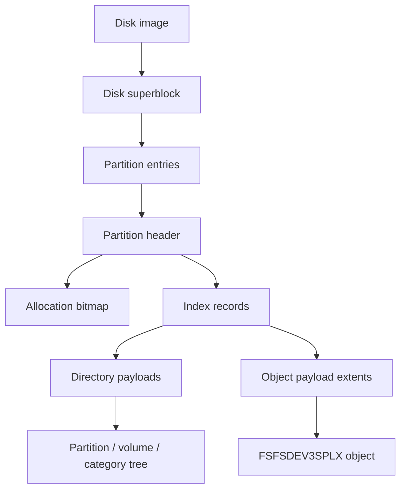

# SFS Filesystem

Yamaha A-series hard-disk images use an SFS container for partitions, directories,
object files, and allocation state. File extents contain the
sampler object payloads described in [Sampler Data Structures](sampler-data.md).

SFS is the hard-disk container family used by `.hda`, `.hds`, and equivalent raw
hard-disk images. It is not FAT12 and it is not ISO9660. FAT12 floppies and
CD-ROM images can carry the same sampler object payloads, but their container
layers are different.

## Specification Scope

This page describes disk structures and the A-series formatted layout. Fields
with unspecified meaning must be preserved; their presence is not permission
to assign new values. Software capabilities and editing guarantees are covered
separately in [Media Profiles](media.md) and [Writer And Alteration](write.md).


```mermaid
flowchart TD
  image[Disk image] --> super[Disk superblock]
  super --> part[Partition entries]
  part --> phead[Partition header]
  phead --> bitmap[Allocation bitmap]
  phead --> index[Index records]
  index --> dir[Directory payloads]
  index --> file[Object payload extents]
  dir --> tree[Partition / volume / category tree]
  file --> object[FSFSDEV3SPLX object]
```

## Byte Order And Units

SFS container numeric fields are big-endian. Locations are sector or cluster
indexes; multiply by the corresponding unit size to obtain byte offsets.

Common units:

| Unit | Size or rule |
| --- | --- |
| Sector | Stored in the disk superblock, commonly `512` bytes. |
| Cluster | `sector_size * sectors_per_cluster`; commonly two sectors. |
| Index record | `72` bytes. |
| Index block | One cluster; `floor(cluster_bytes / 72)` complete records. |
| Directory entry | `32` bytes in current directory payloads. |
| Extent triplet | `12` bytes. |

## Disk Superblock

An SFS disk image starts with a superblock. The second sector stores a duplicate
copy. A disagreement is a structural inconsistency, not another filesystem.

| Offset | Size | Type | Meaning |
| --- | ---: | --- | --- |
| `0x000` | 11 | ASCII | Disk signature `YAMAHA_dev3`. |
| `0x00b` | 117 | bytes | Reserved area; semantics unspecified. |
| `0x080` | 28 | bytes | Disk mode/device metadata; individual meanings unspecified. |
| `0x09c` | 4 | u32be | Sector size in bytes. |
| `0x0a0` | 4 | u32be | Total sector count in the image. |
| `0x0a4` | 4 | u32be | Reserved value; semantics unspecified. |
| `0x0a8` | 64 | table | Eight partition entries, each 8 bytes. |
| `0x0e8` | 280 | bytes | Reserved area; semantics unspecified. |

Partition entry layout:

| Entry offset | Size | Type | Meaning |
| --- | ---: | --- | --- |
| `+0x00` | 4 | u32be | Partition start sector. |
| `+0x04` | 4 | u32be | Partition sector count. |

A valid active partition entry has both values non-zero. Both zero means an
unused entry; exactly one nonzero value is invalid geometry, not an unused slot.

A-series hard-disk images also use sector 2, and for multiple partitions the
sectors immediately before later partitions, as auxiliary formatter-transfer
sectors. Their leading eight bytes are deterministic transfer tokens from
`ab432100` through `ab432107`; the low three bits carry the partition sequence,
and the remaining token bits are compatibility values rather than disk geometry
or persistent disk IDs. Generated images zero prior-token residue at
`+0x09..+0x10`.
These sectors are outside the directory and object tree.
Older label-entry marker/name records in them are intentionally zero-generated;
they are not required for hardware loading.

## Partition Header

Each active partition starts at its partition start sector. The partition header
occupies one sector. Its duplicate is one cluster after the primary, at
`partition_start_sector + sectors_per_cluster`. The rest of each reserved
header cluster is padding, not additional header fields.

| Offset | Size | Type | Meaning |
| --- | ---: | --- | --- |
| `0x000` | 11 | ASCII | Partition signature `YAMAHA_dev3`. |
| `0x040` | 16 | ASCII | Partition name, space-padded. |
| `0x080` | 4 | u32be | Sectors per cluster. |
| `0x084` | 4 | u32be | Large allocation unit, in clusters, for records with attribute `0x20000000`. |
| `0x088` | 8 | bytes | Reserved bytes; semantics unspecified. |
| `0x090` | 4 | u32be | Number of clusters in the partition. |
| `0x094` | 4 | u32be | Active allocation bitmap cluster. Independent of cluster size. |
| `0x098` | 4 | i32be | Bitmap copy 1 location; a negative value marks the copy unavailable. |
| `0x09c` | 4 | i32be | Bitmap copy 2 location; a negative value marks the copy unavailable. |
| `0x0a0` | 4 | u32be | Formatter capacity value. The standard generated profile uses `5012`; exact packing semantics are unspecified. Usable record capacity follows the index geometry. |
| `0x0a4` | 4 | u32be | Cluster offset to the directory/file index. |
| `0x0a8` | 4 | u32be | Directory/file index span in clusters. |

A-series partitions have matching primary and duplicate header clusters. With
two sectors per cluster, each copy occupies 1024 bytes. Unknown header bytes
are preserved on unrelated edits.

Cluster offsets are partition-relative. Convert a cluster offset to an absolute
byte offset with:

```text
absolute_sector = partition_start_sector + cluster_offset * sectors_per_cluster
absolute_offset = absolute_sector * sector_size
```

## Allocation Bitmap

Partition-header field `0x094` selects the active bitmap. It must match a
positive location in `0x098` or `0x09c`. A negative location denotes an
unavailable copy at its arithmetic absolute value, not a masked sign bit.
Each allocation bitmap stores one bit
per cluster. A set bit means the cluster is allocated; a clear bit means it is
free.

```text
bitmap_offset = (partition_start_sector
                 + bitmap_cluster_offset * sectors_per_cluster)
                * sector_size

bitmap_bytes = ceil(number_of_clusters / 8)
byte_index   = cluster_offset // 8
bit_mask     = 0x80 >> (cluster_offset & 7)
allocated    = (bitmap[byte_index] & bit_mask) != 0
```

SFS stores two complete copies of the allocation bitmap:

| Copy | Location |
| --- | --- |
| Copy 1 | Absolute value of the signed cluster location at `0x098` |
| Copy 2 | Absolute value of the signed cluster location at `0x09c` |

Each copy occupies the cluster-rounded span needed for all partition clusters,
not only its first 512-byte sector. It lies in the reserved prefix before the
index, without overlapping another metadata region or either header cluster.
For example, a bitmap for 359,999 clusters
has 45,000 meaningful bytes and occupies 45,056 bytes in a 1024-byte-cluster
partition. The first span ends where the second span begins
in the current formatter geometry.

Each bitmap copy must be compared with the allocation described by index-record
extents. A used bit without an owning extent, or an extent marked free, is an
inconsistency. Directory reachability does not change extent ownership.

The reserved metadata prefix is implicit in the partition geometry. It is not
an index-record extent and is therefore not marked in the reconstructed bitmap.
A clear bitmap bit in that reserved prefix does not make the metadata available
for payload allocation. A set bit there does not create an index-record claim.
Records left unreachable after deletion can still reference extents; their
allocation disagreement must not be silently treated as consistent storage.

Both copies span the full cluster-rounded bitmap size, not a 512-byte preview.
Free space depends on the selected valid copy. Invalid selection or an
unavailable copy does not justify synthesizing allocation state. Before changing
allocation, reconcile both copies, extent totals and ownership. Cluster sizes
other than 1024 bytes, including 4096 bytes, occur in SFS images.

## Free Space

SFS free space excludes both the reserved metadata prefix and clusters marked
used in the allocation bitmap:

```text
first_payload_cluster = directory_index_cluster + directory_index_span
free_clusters = cluster_count - first_payload_cluster - allocated_clusters
free_bytes = free_clusters * sectors_per_cluster * sector_size
sampler_visible_free_kib = free_bytes // 1024
```

Allocation summaries use the same payload-only accounting. Consequently,
`reserved_clusters + allocated_clusters + free_clusters == cluster_count`,
where allocated and free clusters both exclude the reserved prefix. Free-run
counts and the largest free run are likewise measured only in the payload
region.

## Directory And File Index

The directory/file index starts at partition header field `0x0a4`:

```text
index_offset = (partition_start_sector
                + index_cluster_offset * sectors_per_cluster)
               * sector_size
```

The index is divided into cluster-sized blocks. A 1024-byte block has 14 records
and 16 trailing bytes; a 4096-byte block has 56 records and 64 trailing bytes.
Scanning stops at the declared index span, not the first recognizable object.

```text
records_per_block = cluster_bytes // 72
record_offset_in_index = (sfs_id // records_per_block) * cluster_bytes + (sfs_id % records_per_block) * 72
absolute_record_offset = index_offset + record_offset_in_index
```

The inverse mapping is:

```text
block = record_offset_in_index // cluster_bytes
slot  = (record_offset_in_index % cluster_bytes) // 72
sfs_id = block * records_per_block + slot
```

Offsets in the trailing bytes are not records.

The index span also creates a finite record-slot capacity independent of payload
free space:

```text
index_bytes = directory_index_span_clusters * sectors_per_cluster * sector_size
index_blocks = directory_index_span_clusters
total_record_slots = index_blocks * records_per_block
allocatable_record_slots = total_record_slots - 3
```

SFS IDs `0`, `1`, and `2` are reserved. The fresh-image profile has 358 index
blocks, 5,012 total record slots, and 5,009 allocatable slots. Existing images
need not use that profile: their capacity follows the partition header's
index span and cluster geometry.

Each distinct Yamaha object consumes one record slot. Creating a destination volume consumes six additional
scaffolding record slots. Consequently, a partition can have enough free payload
clusters while having no free SFS record slots. These are independent capacity limits.

## Index Record Layout

An index slot describes a file or directory through its logical byte count
and extents:

| Record offset | Size | Type | Meaning |
| --- | ---: | --- | --- |
| `0x00` | 2 | u16be | Extent count. |
| `0x02` | 2 | u16be | Reserved or flags; current valid data records use zero here. |
| `0x04` | 2 | u16be | Total cluster count. |
| `0x06` | 4 | u32be | Logical data size in bytes. |
| `0x0a` | 4 | u32be | First data cluster for direct records, or continuation-list cluster for multi-extent records. |
| `0x0e` | 4 | u32be | First direct extent cluster count for direct records. |
| `0x12` | 4 | u32be | First direct extent byte count for direct records. |
| `0x3a` | 4 | u32be | Creation-time field; the A4000 profile uses the unavailable value `0xffffffff`. |
| `0x3e` | 4 | u32be | Modification-time field; the A4000 profile uses the unavailable value `0xffffffff`. |
| `0x42` | 4 | u32be | Native attribute/type word. |
| `0x46` | 2 | u16be | Filesystem link count. |

These are native SFS attributes, not POSIX permissions. The upper seven bits
form a flag field (`0xfe000000`); the lower 25 bits form a separate type/value
field (`0x01ffffff`). Changing one portion must preserve the other.

| Mask | Meaning and modification constraints |
| --- | --- |
| `0x80000000` | Live index record. Set during creation, cleared on final release. |
| `0x40000000` | Meaning unspecified; preserve. |
| `0x20000000` | Use the partition's large allocation unit for payload extents. |
| `0x10000000` | Meaning unspecified; preserve. |
| `0x08000000` | Enables the ordinary file-write/extension path. A writable open handle and writable partition are also required. |
| `0x04000000` | Meaning unspecified; preserve. |
| `0x02000000` | Set together with `0x08000000` during directory updates and cleared with it afterward. Its independent meaning is unspecified; preserve on unrelated file edits. |

Ordinary files use type/value zero. Directory and link tags are `0x00646972`
(`dir`) and `0x006c6e6b` (`lnk`). The latter must not be assumed to denote a
POSIX symbolic link with a pathname payload. Normal A4000 and SU700 path
lookup opens the final entry's own record; intermediate path components must
be directories. It does not substitute a pathname stored in a `lnk` payload.
The intended payload representation of `lnk` remains unspecified. The link
count is separate from this tag: multiple directory references do not by
themselves require `lnk`. Other type/value encodings remain unspecified.

A3000 V2 and SU700 ordinary-file selection omits `lnk`-tagged records.
A filesystem directory entry is therefore not necessarily a selectable
sampler object. This listing behavior does not define the link's payload
or make it safe to replace the tag with the ordinary-file value.

Unlinking a non-directory entry decrements its record's link count. While
more than one reference remains, its type/value is retained. When the count
becomes one, the lower 25 bits are cleared to zero and all upper flags are
preserved. This transition applies to non-directory types generally, not only
`lnk`; it does not rewrite the surviving payload. A count of zero permits
final release of the record and its payload allocations.

With `0x20000000` set, payload extent allocation starts on a multiple of the
partition-header `+0x084` unit, measured from the partition's cluster origin.
Allocated extent lengths are multiples of that unit. Logical byte lengths
need not fill that capacity. Without the flag, ordinary growth uses a minimum
of two clusters. Continuation records are separate metadata allocations;
they do not acquire the payload's large-unit requirement. Preserve both the
flag and the corresponding allocation geometry when replacing or resizing data.
Clearing the flag is not a substitute for respecting the stored policy.

Common combinations include `0x94000000` for support records,
`0x94646972` for directories, `0x9e000000` for ordinary writable files, and
`0xbe000000` for writable files using large-unit allocation. These are
combinations, not indivisible permission codes: `0x9e000000` adds
`0x0a000000` to `0x94000000`, and `0xbe000000` adds `0x20000000`.

SU700 native SFS saves select large-unit allocation for newly created files
in the `SAMP` and `SUSP` category directories. This is a creation default,
not a file-extension rule or an instruction to change existing attributes
when a file is reopened. Ordinary and large-unit files retain the same extent
and logical-length representation; their allocation policies differ.

A directory without the write-enable bit is not equivalent to a user-locked
directory: directory updates temporarily enable writing. The bit is not a
general delete or rename permission, nor does it by itself guarantee that a
mutation is safe. Unspecified bits must not be translated into read, execute,
hidden, system, owner or group permissions.

A live allocation-free empty file has zero extent count, cluster count and
logical size, with the live bit set. It remains an addressable record and
reads as zero bytes; it must not be mistaken for an unused index slot or
consume payload clusters. Reserved support files can also use this form.
Malformed zero-extent records with a nonzero size are not admitted as empty
files. Adding these records to the inventory does not create sampler objects.
For live records, the native directory type is authoritative: ordinary file
bytes that happen to resemble dot-directory entries do not become directories.

The link count counts references to the record, not entries contained in it.
An ordinary file normally has one link. A directory with one parent has two
links before child directories are added: its parent's entry and its own `.`.
Each child's `..` adds another link. The root's `.` and `..` both refer to
itself. Ordinary file children do not increase their containing directory's
link count. Existing values must be preserved unless the corresponding links
are changed; deleting one name must not free data still referenced elsewhere.

The time fields above are not usable wall-clock dates in the A4000 profile.
Do not interpret the unavailable sentinel as an epoch value or invent a clock
encoding for other devices. Preserve existing raw values on unrelated edits.

The data-size field is the logical byte length of the object or directory. Allocated storage can be larger because cluster allocation is
rounded up to full clusters.

## Direct Extents

Records with one to four extents store extent triplets directly in the index
record. Triplets start at `0x0a` and have this layout:

| Triplet offset | Size | Type | Meaning |
| --- | ---: | --- | --- |
| `+0x00` | 4 | u32be | Cluster offset. |
| `+0x04` | 4 | u32be | Cluster count. |
| `+0x08` | 4 | u32be | Byte count to read from this extent. |

Direct read algorithm:

```text
remaining = record.total_data_size
for each direct extent in order:
    capacity = extent.cluster_count * sectors_per_cluster * sector_size
    read_size = min(extent.byte_count, capacity, remaining)
    append bytes from cluster_absolute_offset(extent.cluster_offset)
    remaining -= read_size
```

The extents must supply `total_data_size` logical bytes; a shorter assembled
payload is incomplete.

## Continuation Extents

Records with five or more extents use a continuation-list cluster. The index
record field at `0x0a` points to the first list cluster. Each continuation-list
cluster is allocated storage and starts with this layout:

| Offset | Size | Type | Meaning |
| --- | ---: | --- | --- |
| `0x00` | 4 | u32be | Number of triplets in this list cluster. |
| `0x04` | 4 | u32be | List bookkeeping value. |
| `0x08` | 4 | u32be | Next list cluster, or zero at the end. |
| `0x0c` | variable | triplets | 12-byte extent triplets. |

Continuation read algorithm:

```text
list_cluster = record.first_cluster
remaining_triplets = record.extent_count
while list_cluster != 0 and remaining_triplets > 0:
    read one cluster at list_cluster
    read triplet_count and next_list_cluster
    append triplets at +0x0c
    mark list_cluster allocated
    list_cluster = next_list_cluster
```

List traversal ends after the declared extent count. Loops, out-of-range list
clusters, and impossible triplet counts make the chain invalid.

## Directory Payload Entries

Directory payloads contain 32-byte entries. Directory entries connect a name to
an SFS ID in the same partition.

| Entry offset | Size | Type | Meaning |
| --- | ---: | --- | --- |
| `0x00` | 2 | u16be | Entry size in bytes: `0x0020` for the supported 32-byte layout. Not an attribute mask. |
| `0x02` | 2 | u16be | Name length including the NUL byte in current entries. |
| `0x04` | 4 | u32be | Link ID. For current reads this maps to an SFS ID. |
| `0x08` | variable | ASCII | Entry name bytes, NUL-terminated or padded. |

Special names `.` and `..` are directory navigation entries. Other entries are
matched to index records by `link_id`. The target index record specifies whether the entry is a directory or file.

### Deleted directory rows

Deletion can retain a 32-byte row with the link ID's high nibble replaced by
`0xF`. Such a row is a tombstone: its remaining link bits do not identify a live
SFS record. Retain its bytes when not reusing the slot. A non-`0xF` row remains
live, and a missing target is a dangling link.

Partition-root support names `sfserrlog` and `sfserram` can exist without normal
target records. This exception is specific to root metadata names, not arbitrary
missing files or identically named entries below the root.

## Object Payload Resolution

SFS object loading follows this path:

```text
directory entry -> link_id -> index record -> extents -> payload bytes
```

A sampler object payload begins with `FSFSDEV3SPLX`; its type is at
`0x0c..0x0f`. Ordinary A-series directory placement is
`partition / volume / category / object`, with categories such as PROG, SBAC,
SBNK, SMPL and SEQU. SFS itself can also store non-sampler files. See
[Sampler Data Structures](sampler-data.md) for object contents.

## Structural Consistency

Check signatures, duplicate headers, both allocation copies, complete extent
lists, logical byte totals, directory links and reference counts independently.
A readable file does not establish consistency of the whole partition. A
malformed sampler payload does not by itself change the surrounding SFS layout.

## Generated Images

The generated A-series geometry and compatibility fields are specified in
[Writer And Alteration](write.md#a-series-formatted-layout). They do not define
valid defaults for arbitrary existing SFS media.

## Minimal Read Walkthrough

A minimal SFS reader performs these steps:

1. Read sector 0 and check `YAMAHA_dev3`.
2. Read sector size and the eight partition entries.
3. For each active partition, read the partition header and cluster geometry.
4. Read both complete allocation bitmap copies and the directory/file index
   region.
5. Walk 72-byte index records using the 14-record-per-block mapping.
6. Read directory payloads and match entry `link_id` values to SFS IDs.
7. For each object file entry, read extents and return logical payload bytes.
8. Interpret `FSFSDEV3SPLX` payloads using their own type-specific layouts.
9. Compare both allocation copies with each other and with extents reconstructed
    from the index before allowing any mutation.
